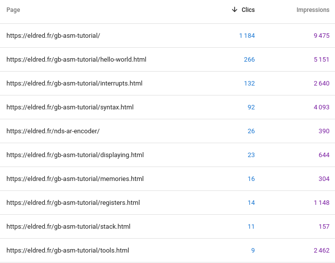

+++
title = "State of GBDev - March 2021"

aliases = [ "blog/2021/03/08/gbdev-status" ]

[taxonomies]
tags = ["gbdev"]
+++

This originally started as [a Twitter thread](https://twitter.com/issotm/status/1368885465923870721) that got <s>out of hand</s> 30 tweets long.

[Avivace](https://twitter.com/avivace4) asked me if I could make it into a blog post of some kind, and I figured that it was a good idea, *and* I might as well clean up a few things, *and* possibly add some images.

<!-- more -->

## Context

I write this in early March 2021, right after finishing the last homework of what should be my last semester in education; my finals will be next week, but until then I have no more classes.

A small breathing room after some stressful weeks is nice.
Additionally, I had promised I'd publish a new RGBDS pre-release, which I wanted to talk about, and then that digressed into a more general GBDev status.

This is written from my point of view; it's **definitely** not meant to be an objective summary of where the community is now, I'll leave that to Avivace instead.

I don't touch most of the administrative side of GBDev, and honestly, it's for the better.
It allows me to focus more on carrying out projects (mainly [RGBDS](https://rgbds.gbdev.io), as many know), and my TODO list keeps being too long anyway.

Well, let's not digress: here's my state of GBDev, as of March 2021.

## RGBDS

As of right now, the interim changelog for 0.5.0-pre is bigger than any previous one, so I'll try to publish the release soon.
We're aiming for roughly 1 month of testing before we publish the release proper.

I've had a few occasions to ponder about RGBDS essentially being a [0ver project](https://0ver.org) now.
*(Quick summary: software with version "0.x" is supposed to be unstable and not ready for public use. However, many projects being depended upon still use 0.x because they are afraid from the implied stability guarantees expected from 1.x software, despite already implementing them in practice.)*

And, indeed, [many](https://github.com/pret/pokecrystal/) [a](https://github.com/ISSOtm/quartet-intro) [project](https://github.com/daid/LADXR) [depends](https://github.com/pinobatch/libbet) [on](https://github.com/zladx/LADX-Disassembly) RGBDS.
I think, however, that it has *some* merit in staying in 0ver despite the circumstances; lemme explain...

RGBDS is a project that [started in the late 90's](https://rgbds.gbdev.io/docs/v0.4.2/rgbds.7#HISTORY), so it shouldn't come as a surprise that it's full of legacy problems.
Here's a small list off the top of my head:

- RGBGFX is a buggy mess (sorry, stag :/) that needs both a core *and* an [interface](https://github.com/gbdev/rgbds/issues/487) [overhaul](https://github.com/gbdev/rgbds/issues/575)
- Debugging support is limited because we lack a way to produce line mappings
- Indentation rules are still weird, and keep confusing people
- The code is generally in a sorry state, though improving
- We lack documentation, notably about the general code architecture, and some processes

### Backwards compat

We're expecting some of these changes (such as the 3rd item in the above list) to break backwards compatibility, like others before them.
Some could argue that we shouldn't break it in the first place, and they have a point.
However, I chose to prioritize usability over compatibility, as I believe we need to have easy-to-use tools if we want to keep the community alive.
Besides, we will keep hosting old versions, so that projects that aren't actively maintained can still be compiled.
(If they don't document the RGBDS version they were expecting, it should still be able to be inferred from the release date, and it's not something we have control over either.)

Further, we've fixed bugs that *were* obvious bugs, but that broke backwards compatibility.
The most telltale example that I keep bringing up is ["labels can be defined with colons in their names"](https://github.com/gbdev/rgbds/issues/362).
And while we could *in theory* e.g. provide a switch for the old and new behavior, the complexity of such a system is too much for a mostly-one-man-team, both in design and implementation.

If we were a larger, paid team, offering a more widely depended upon service, we'd put more effort into backwards compatibility.
But we're hobbyists and I'm doing this in my free time, so I'll prioritize my sanity.
And since most of our active users are fine with the slow pace of breaking changes, we probably struck a good balance.

### Moving forward

Back to the topic of 0ver: until we, and by that I mean the community at large, is satisfied with RGBDS' feature set; and when the maintainers are satisfied with the maintainability of the codebase, THEN we will release 1.0.0.

What's more, it's not just empty words, we're making great progress towards that goal!

Over the last year or so, there have been many significant overhauls ([\[1\]](https://github.com/gbdev/rgbds/commit/f9f27d6f5a00898f7d3faaee921ab8d13e13b85a) [\[2\]](https://github.com/gbdev/rgbds/commit/304bb9f902f2a6a5fb39f19d2be8f4698246c435) [\[3\]](https://github.com/gbdev/rgbds/pull/557) [\[4\]](https://github.com/gbdev/rgbds/commit/bd244e68654533cd817aba5794c5669707cd4578) [\[5\]](https://github.com/gbdev/rgbds/commit/41d544a4ebb7ef7d6343bfb5a96bcbd553d57b4f) [\[6\]](https://github.com/gbdev/rgbds/commit/fa0fa4d5ac9e806f4e1770e1fcab7cf3c5bc5289) [\[7\]](https://github.com/gbdev/rgbds/commit/a679e0224603ca629bff991a470b8ad60ecfd053)) to the codebase, which improved both code quality and performance!
I kickstarted a lot of the effort, but [Rangi](https://github.com/Rangi42) picked up the pace, and is now doing a lot of the heavy lifting—more on that below.

nitro2k01 measured a 2× speedup between an old version of RGBDS and a build close to 0.4.2-pre.
This may not mean much, due to this possibly encompassing a lot of different factors, but is at least reassuring :)

### [You're not alone](https://www.youtube.com/watch?v=99a7dZw0ThE)

As I said above, Rangi is helping a lot: she's both active in the design side of issues, and writing a lot of code herself.

This is good news for a lot of reasons:

- The [bus factor](https://en.wikipedia.org/wiki/Bus_factor) is reduced. I hoped that she could become the main maintainer, but she declined. I don't blame her, what she's doing now is already hugely helpful.
- It proves that it is possible for outsiders to learn the codebase, though I had to give her some pointers at the beginning. It's not perfect, but we can work on that!
- We don't always agree, but having input from a different point of view than mine is certainly helpful towards making RGBDS useful for more than just me.
- Having to mostly review code instead of writing it is allowing me to shift my focus elsewhere...

... and this is why, despite my workload increasing as usual at this time of the year, RGBDS 0.5.0 will have the biggest changelog yet, *by a landslide*.
The only reason why it hasn't been released earlier, is because since Rangi kept adding new features, so we didn't have time to test them 😁

## Roadmap

Since RGBDS should eat less of my free time now, I'm planning to spend this time on other projects.
Here are the next three in the queue:

1. To C Or Not To C 2
2. `rsgbgfx`
3. gb-asm-tutorial

### To C Or Not To C 2

["To C Or Not To C"](https://gbdev.io/to_c_or_not_to_c.html) is an "old" writeup of mine that aimed to provide insight into whether to use ASM or C for Game Boy programming.

This was written a few years ago, and the scene has evolved since.
It's also an opinionated document, I'll admit, and I grew up since, too.
[bbbbbr](https://github.com/bbbbbr) already did [the first half of the work](https://github.com/gbdev/gbdev.github.io/pull/27), now it's my turn to do the second half.
I hope to get to it during April, hopefully getting it done in May.

### `rsgbgfx`

[`rsgbgfx`](https://github.com/ISSOtm/rsgbgfx) is a Rust rewrite 🦀 of one of RGBDS' components, the PNG-to-GB-gfx converter.
The current tool has terribly messy code (sorry again, stag) and needs its interface + processes adapted to the needs that surfaced since then.

I chose Rust because I wanted something that would be like the rest of RGBDS: standalone and lightweight.
I also wanted good libs, because it's better to build off of others' work if you can.
I didn't pick C++ because I'm already fairly comfortable with it, and I want to practice my Rust more.

### gb-asm-tutorial

Ah... [Near had *Bahamut Lagoon*](https://www.vice.com/en/article/bvxezw/a-23-year-perfectionist-journey-to-localize-the-obscure-bahamut-lagoon), I guess this one will be my own white whale.

Here's the context: there exist a bunch of Game Boy programming tutorials, a lot in ASM; but they are almost all severely outdated.
Those that aren't, are often lackluster, typically stopping right after "Hello World!", and/or contain bad patterns.

gb-asm-tutorial was my ambitious attempt at making the ultimate GB ASM programming tutorial for beginners!
Ironically, gb-asm-tutorial also stopped soon after Hello World... though it has some good in it nonetheless.

The common thread behind all that I currently do related to GBDev, is striving to make it more accessible. 
Giving newcomers more insight, so they can pick whatever will work best for them, but as early as possible, so they avoid getting discouraged. 
Making tools more useful and user-friendly, so we can shift focus from reinventing the wheel to making games everyone will love.

An essential component in that plan is lowering the barrier of entry; I myself only overcame it out of a) having read prior [a very good tutorial](http://tutorials.eeems.ca/ASMin28Days/welcome.html) on the similar Z80, and b) being curious enough to spend months poring over docs and experimenting.

So, we need something that explains both how to program the system, but also how to turn bytes and code and these weird interfaces into an enjoyable experience.

And in its current state, gb-asm-tutorial is okay at the former, but forgets the latter.

This is why I have in mind to re-do gb-asm-tutorial from scratch.

While I have been thanked for the tutorial's quality, I have also heard a few complaints; and given the apparent traffic on the site vs. how many people thanked me, I'm pretty sure a lot of people have dropped out.

<figure>

<figcaption>These are the top 10 Google requests leading people to <i>anywhere</i> on my website. By the way, it's spelt \"Game Boy\", not \"GameBoy\".</figcaption>
</figure>

<figure>

<figcaption>These are the top 10 pages on my website that people land on from Google.</figcaption>
</figure>

#### gb-asm-tutorial v2

So, the new tutorial would be in 3 parts.
First, explaining how to program on the Game Boy; pure technicalities, only how to run code on the thing.
Then, making a game, to give people some tools they can start experimenting with to create their own games.

The programming explanation would dissect why and how a Hello World program works, instead of first dumping a whole lot of theory, and then making our first program AT THE TWELFTH LESSON. 🤦‍♂️

<figure>

<figcaption>There are only 4 lessons after that, only covering *sigh* yet more theory...</figcaption>
</figure>

Then, there's the part in which we put the "game" in "Game Boy game dev".
My original plan was to do the same as part 1, and simply *show* how to make a game, by example; however, there are issues with that.

I've come to realize that a lot of the code, scripts, and snippets that I post, are too complex for newbies to understand.
It's not just bloat, either—they are complicated, but this is because I've spent a lot of time tweaking them to avoid some non-obvious problems.
The solution to that is simple: show, step by step, how we arrive at that complexity.

But just putting these bits of code and techniques in front of people, and telling them to do that... that's [cargo cult](https://en.wikipedia.org/wiki/Cargo_cult_programming), and I don't want that.
"Do this, because it's better"—but *why* are the other ways bad?

Further, I noticed that people had a tendency not to heed my warnings about X problem until it (and its consequences) hit them straight in the face.
I guess that people don't truly learn to avoid mistakes until they experience the consequences themselves?

The solution I believe in, is simply to botch it!

If the reader needs to experience the problems first-hand to avoid bad pratice, then let's let them!
We wouldn't make one, but *two* games.
First doing using all sorts of obvious but shoddy practices, so that the reader will understand why they should be avoided.
And *then*, we'd make another game, this time having learnt the lessons from the first; along the way, the tutorial could also teach more advanced use of the hardware!

So then we have: 
Part I — Dissecting a Hello World to learn the hardware 
Part II — Write a game the Obvious ways, experience the pitfalls 
Part III — Write a game the Better ways, learn advanced tricks

Sounds great, but there's a teeny-tiny problem.
Two, even.

1. This means the tutorial will be even longer
2. This means that I need to write a game in the "newbie-obvious" shoddy ways, which I've spent the last few years un-learning. Agh.

Part II will be the single hardest thing to write in the entire tutorial.
So, obviously, I'm gonna need some help, and to spend a ton of time planning everything before I publish even a single page.

Even if I were to work full-time on it, I'd probably need more than a year...

What's more, I want to additionally teach how to debug code—something I don't believe many tutorials do?
But this implies INTENTIONALLY inserting bugs into the tutorial code, in a way that will be simple enough to debug that the reader will understand it, making the task even harder!

Maybe I'm setting the bar too high. We'll see, there's time. The first 2 items on the TODO list will have to be taken care of first, anyway, and they won't be done quickly either.

#### Technicalities

I will also want to re-design gb-asm-tutorial.
The site looks kinda like ass, and I want to improve that.
I will also switch from that custom templating system over to Jekyll, since I'm now much more comfortable with it, and it's directly built into GitHub Pages.

On that note, I'm looking for help on the design side.
If you'd like to help, first off, *thank you very much*, and second, you can find me [anywhere in GBDev](https://gbdev.io/chat.html).

## Ending thoughts

All that's left, then, it to get excited about everything that will happen soon!
The next RGBDS release, To C Or Not To C 2, and hopefully soon, gb-asm-tutorial v2 😊

I wish you all a great year 2021, and hopefully we'll see you in GBDev 😉

## Back-links

Check out [the GBDev community](https://gbdev.io) for more Game Boy development! :)

<small>[Thanks, Vegard!](https://twitter.com/vegard_no/status/1368899077908402178)</small>
