+++
title = "The wonders of Prehistorik Man on the GB"
authors = [ "stuff@eldred.fr (ISSOtm)" ]

aliases = [ "blog/2022/05/22/prehistorik" ]

[taxonomies]
tags = [ "gbdev" ]

[extra]
breadcrumb = "Prehistorik Man"
+++

Recently, GumpyFunction remarked on *Prehistorik Man*'s parallax effect on the original Game Boy.
While this game is not one of the console's best known, being somewhat a average title, it's one of, if not the most technically impressive *commercial* releases on the platform.

<!-- more -->

<blockquote class="twitter-tweet">
Playing through some Prehistorik Man on the <a href="//twitter.com/hashtag/gameboy">#gameboy</a>. Some serious coding wizardry with the pseudo parallax backgrounds. It even shifts perspective as Sam jumps up. Really an incredible feat on the hardware considering the graphics are all tile based! <a href="//t.co/mRHWM6LOlG">pic.twitter.com/mRHWM6LOlG</a>
&mdash; GumpyFunction (@GumpyFunction) <a href="//twitter.com/GumpyFunction/status/1526013758019346432">May 16, 2022</a></blockquote>  

And this parallax effect is far from the most impressive punch this game packs despite its unassuming looks.
Let's explore various tricks, and see how the sausages are made!

*Apologies in advance: some of the footage is a bit choppy, as my laptop tanks a bit while recording. Sorry!*

## Context

Despite the name, this game is actually a port of *Prehistorik 2* on the SNES.
It was published in 1996 by Kemco in Japan, and Titus everywhere else.

Worth pointing out is its programmer, Elmar Krieger...

<figure>

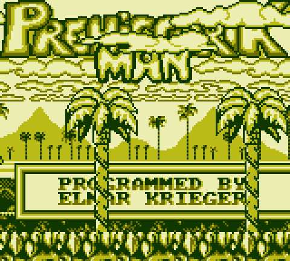

<figcaption>By the way, we'll come back to this title screen.</figcaption>
</figure>

[A secret message](//tcrf.net/Prehistorik_Man_(Game_Boy)#Secret_Greetings_Message) reveals that Elmar also has worked in the [demoscene](//en.wikipedia.org/wiki/Demoscene).
This should explain *why* this game is so technically impressive.

### Technical background

The rest of this article assumes familiarity with the Game Boy's graphics.
If the terms "tile", "tilemap", "OBJ", and "palette" don't ring any bells to you, I recommend [Pan Docs' excellent primer](//gbdev.io/pandocs/Rendering).

## Parallax

Let's start with the original effect, though it's not the simplest.

<video controls muted src="parallax.mp4"></video>

This would be simple if the Game Boy had a second background layer (which it doesn't[^window]), so what gives?

Let's bring out trusty [BGB](//bgb.bircd.org)'s trusty VRAM viewer, and see what's happening in the tilemap.

<video controls muted src="parallax_vram.mp4"></video>

What the game does is a somewhat classical trick: the tiles themselves are being modified!
The effect here, however, is multi-tiered:

- The pattern moves "against" the camera, creating a slower movement speed, and thus the illusion of depth.
  For example, if the pattern is shifted right 1 pixel when the camera moved left by 2, it seems to only move by 1 pixel left while the "foreground" moved by 2.
- There is also "passive" movement in the form of the river flowing—at different rates, even, further reinforcing the depth!
- Since the pattern repeats horizontally, no special handling is required; however, vertical movement requires not only the pattern to be shifted vertically, but the tilemap must also be updated!
- As if this was not enough, some of the horizontal "strips" also get thickened as the pattern moves upwards.

All of this helps grounding that background in space; it feels much more than what most 16-bit games were going for, honestly: even *Sonic 1*'s famous Green Hill Zone didn't have any of these vertical effects!

Since this is all done directly on the background layer and on whole tiles (for performance[^1bpp]), you may notice that some pixels of the surrounding mountains are white and not "transparent".
Ah well, it's a small price to pay.

[^window]: The Window is not *exactly* a second background layer. Since it fully overrides the background, there's no transparency; so it's simpler to say there is only one layer.

[^1bpp]: Performance is also likely why the background only uses one color: this allows treating those graphics as 1bpp, processing less data and accessing VRAM less. (Accessing VRAM is a slow and annoying bottleneck most of the time.) This also works out as an aesthetic choice, since [scenery further away tends to fade out](//en.wikipedia.org/wiki/Aerial_perspective).

## OBJ overloading

...Something seems weird about that last video.
I should re-watch it.

Hold on a second, did you catch that?

<figure>

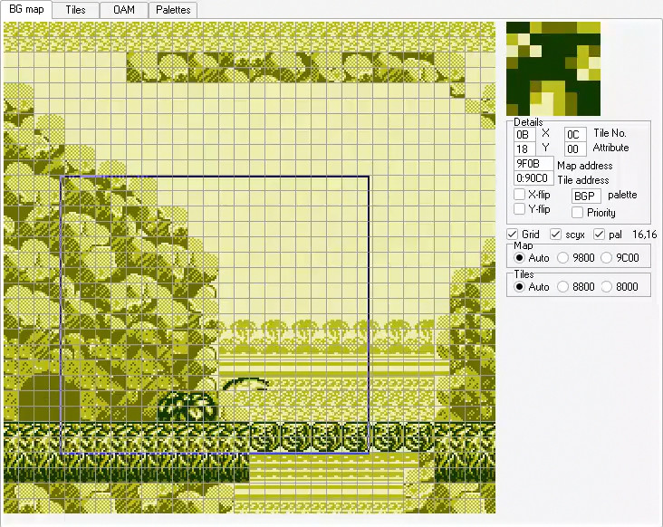

<figcaption>Zoom, enhance!</figcaption>
</figure>

For some reason, for a single frame, part of the dinosaur appears on the background tilemap.
What's going on?

### No stepping on Sam's feet

Let's focus on a part of the Game Boy's rendering system: OBJ[^obj] priority.

[OBJ priority](//gbdev.io/pandocs/OAM#drawing-priority) is simply a set of rules that determine which OBJ comes out "on top" if two of them overlap.

This is trivial for Game Boy Color software: the OBJ that comes first in OAM (the table in which OBJ metadata is stored) wins.
But non-enhanced games abide by a different set of rules[^compat]: the *leftmost* OBJ wins!
This tends to create ugly overlap:

<video controls loop src="dmg_overlap.mp4"></video>

<figure>

<figcaption>Since the rightmost static OBJ is further right than the moving OBJ, the latter renders on top of the former, creating ugly artifacts.</figcaption>
</figure>

So, why does the game look like this...

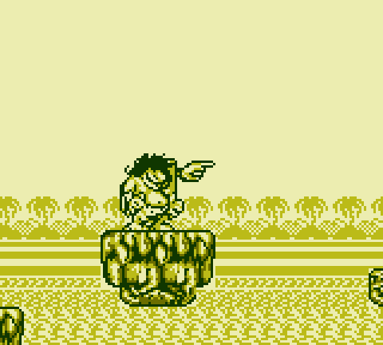

...when it should be looking like this?

The answer lies in the background.

That's right: the game's solution to this problem is to sidestep it entirely, and render any OBJs overlapping Sam's to the background[^cgb], *in software*!

This is much more involved than you'd think:

1. The OBJ must be found to overlap Sam's ("simple" position check)
2. For each of the tiles being overlapped (up to 6):
   1. A copy of the tile must be created, *unless* it's already an "overlap" tile
   2. The OBJ's tile must be shifted around and painted on top (even this is not as easy as it sounds)
   3. The new tile must be written back to the tilemap

This is not all that difficult to do, "just" galaxy 🧠 to even envision, but it's difficult to do *efficiently*—this incurs a lot of accesses to VRAM[^sram], so you can see and hear the game lag with enough overlap (swinging your weapon helps).

[^obj]: OBJ (or "objects") are often called "sprites", but this term is often misused to talk about whole animation frames, actors, and more; so I avoid using it.

[^compat]: The Game Boy Color's PPU actually implements both sets of rules, and switches back to the "old mode" for non-enhanced games for compatibility's sake. Now *that*'s dedication from Nintendo.

[^cgb]: You can actually witness this on a Game Boy Color, since the OBJs being "kicked" to the background will turn green instead of red.

[^sram]: I noticed that the game appears to access SRAM a lot. I'm wondering if it's not keeping a cache of the tiles there, so that it can quickly read them back.

### The Flickies are in another castle!

This same software rendering is applied to sidestep another OBJ limitation.

<figure>

<figcaption>This...</figcaption>
</figure>

<figure>

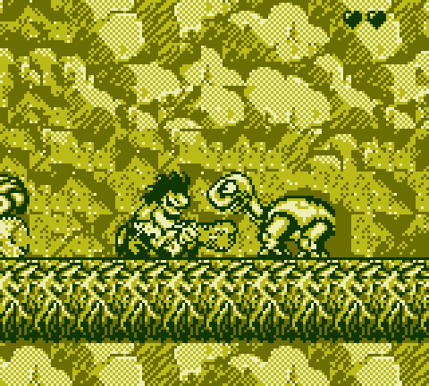

<figcaption>...should actually look like this.</figcaption>
</figure>

The Game Boy hardware is only able to render up to 10 OBJs per horizontal line of pixels.
And, in this scene, Sam is four OBJs wide, the dino six... and then its tail two.

Any excess OBJs (here, the tail's two) are simply not able to be rendered—that's the second screenshot.
Since OBJs that come later in OAM are dropped before objects that come earlier, games typically work partially around this by rotating OAM, which changes which OBJs get dropped each frame, leading to the infamous flickering.

*Prehistorik* instead detects when such overflow would happen (a non-trivial task as well), and renders the OBJ itself.

> <q>If the Game Boy can't, then my code will!</q>
>
> — Elmar Krieger (probably)

## Wavy logo

The "wavy" Titus logo on startup is a very basic effect, but it'll let us discuss an essential concept for what's coming next.

Looking at VRAM shows no signs of the distortion.
So what gives?

<figure>

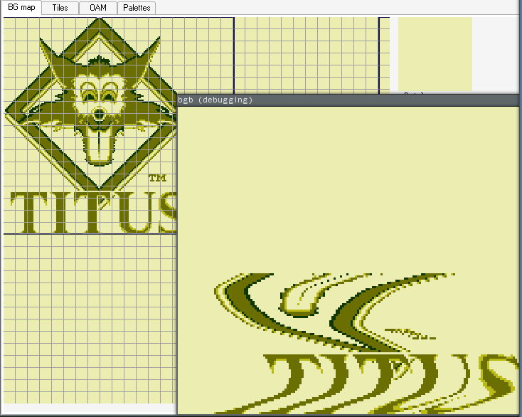

<figcaption>Also, the logo is fully present in VRAM from the get-go! The way it gets slowly revealed uses the same technique.</figcaption>
</figure>

This kind of effect is explained in the excellent [DeadCScroll](//gbdev.io/guides/deadcscroll) tutorial, but here is a brief recap:

- The Game Boy renders the screen line by line (a line of pixels is called a "scanline").
- Rendering parameters, such as the screen's X position in the tilemap (`SCX`), can be changed for each scanline.
- Shifting the X position along a sine table on each new scanline creates a "wavy" effect like this.
- The logo is also "revealed" by blanking the palette at the beginning of the frame, and restoring it later.
  Doing so closer to the top over time allows "revealing" the logo progressively.

## "3D" scroller

<figure>

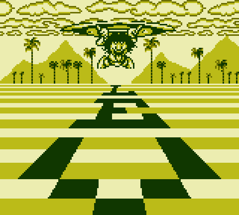

<figcaption>Mode 7 this is not!</figcaption>
</figure>

Whoa, 3D in a Game Boy game!?
Well, while Elmar would later go on and make [a truly 3D tech demo](//www.youtube.com/watch?v=YgANs-gSWTw), this ain't it.

...No, the answer is "unfortunately" much simpler.
Let's take a look at the tilemap.

<figure>

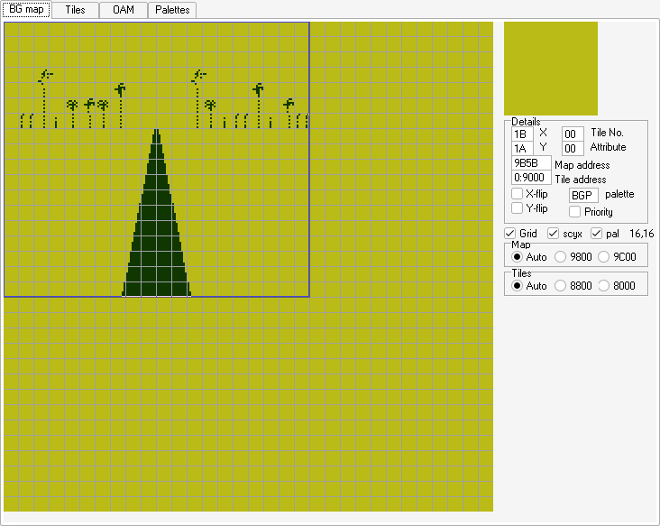

<figcaption>Ah, this looks like some palette trickery...</figcaption>
</figure>

<figure>

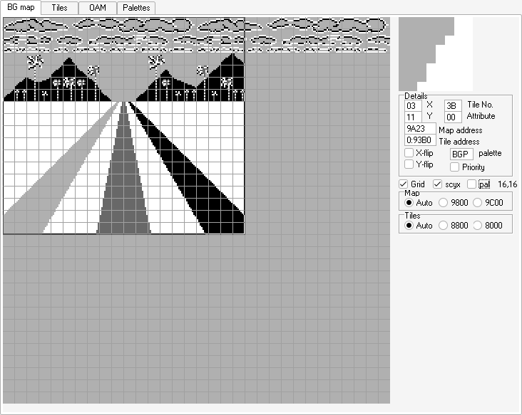

<figcaption>...so let's disable the palette.</figcaption>
</figure>

Aha!
We can see three vertical strips, which each use a different color.
The last two white strips are actually overlaid by OBJs.

So, on each scanline, the game sets background color 0 to either white or light gray; and sets each of the three remaining background colors, plus color 0 of each OBJ palette, to either the same, or black.
Doing this allows applying a texture (sort of) on top of a canvas that gives a 3D illusion.
Then it's a "simple" matter of "scrolling" those palette changes upwards, and boom, quite convincing 3D scroller!

Oh, and, the clouds at the top of the screen.
Simple parallax effect, though this one is simply done by changing the horizontal scroll every few scanlines.
...It's almost trivial, at this point.

## Title screen

<figure>

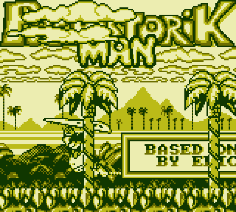

<figcaption>How do I put lightly "GBA-LEVEL GRAPHICS ON A GAME BOY?!"? Well, aside from the lack of colors.</figcaption>
</figure>

There is... *so much* that's going on in this title screen.
Let's dissect the effects, one by one.

### Parallax

The parallax here is, by itself, nothing to write home about.
Simply changing the X position a couple times, creating exactly 7 independent regions:

- The "PREHISTORIK" part of the logo
- Three cloud strips
- The distant mountain silhouettes and palm trees
- The bushes right behind Sam
- The ground Sam flies over

What still deserves a hat tip is the use of horizontal lines behind the bushes: since they are horizontal and smooth, they mask that the scrolling is not uniform (there is a discontinuity between the far background and the bushes); yet their increasing thickness still gives a sense of depth.

They are not done via palette trickery, they are baked directly into the background.
There is nothing technically impressive here.
However, it goes to show that technical prowess is not enough—it also takes an artist's cleverness to put the extra touches that make it convincing.

### Textbox

The big textbox is hard to explain: it moves pretty freely over a scrolling background, but it's too wide to be OBJs, which are restricted to 10 per line, and we already have Sam and the palm trees... so what can it be?

<figure>

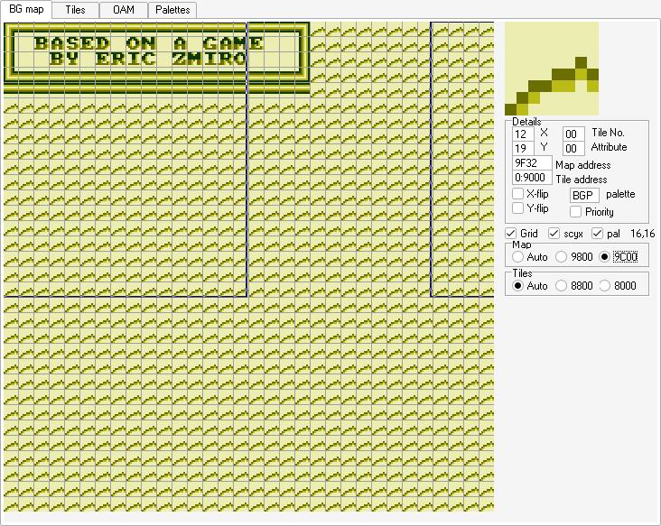

<figcaption>...Oh. It's just the Window.</figcaption>
</figure>

Use of the Window requires that Sam drag the textbox leftwards, and explains why we never get to see its right side: the Window is simply not capable of having background to its right!
The only trickery here is that the Window is enabled at the beginning of the frame, but disabled after the textbox's 32 scanlines, which allows the background to show up normally on the scanlines below it.

### OAM "superloading"

The OAM view of this screen looks weird.

<figure>

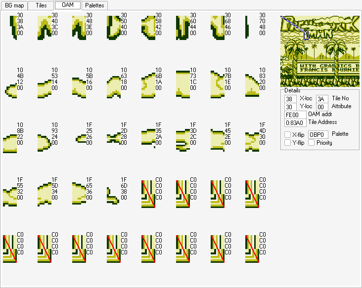

<figcaption>Where is Sam? Where are the palm trees?</figcaption>
</figure>

Despite the game using [8×16 OBJ mode](//gbdev.io/pandocs/LCDC#lcdc2--obj-size), OAM is pretty saturated from the two big clouds at the top and the bottom half of "MAN".
So, *[where is everybody?](//youtu.be/9tQWLg4E90M?t=365)*

As it turns out, right as the "MAN" has been fully rendered, the game performs an [OAM DMA](//gbdev.io/pandocs/OAM_DMA_Transfer) to load a new set of OBJs.
And it also turns out that doing so mid-frame is okay!
It only causes OBJs not to be rendered for its duration[^mid_frame_dma] (of roughly two scanlines), which is why there is a slight gap between the "MAN" and the palm trees.
This also works out aesthetically speaking!

[^mid_frame_dma]: Actually, it's much more complicated than what I just described, and still being researched. But *Prehistorik Man* steers clear of any weird side effects by triggering the DMA during HBlank, so it's all jolly good!

### Palm trees

OBJ overlap is at it again!
I mentioned earlier that both Sam and the palm trees are drawn using OBJs.
If you wondered "wait, how come there are no overlap artifacts?", then give yourself a pat on the back!

And you may have deduced that software rendering is being used here as well.
But you'd be wrong!

<figure>

<figcaption>Despite the visible overlap, the tilemap is clean as can be. How come?</figcaption>
</figure>

The game employs *another* workaround, more CPU-efficient but also more restrictive.
The answer lies in the OAM viewer.

<figure>

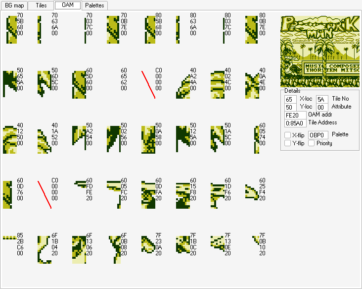

<figcaption>Palm trees lookin' a little transgenic, yo.</figcaption>
</figure>

Interestingly, the palm tree trunks are rendered using two separate OBJs per slice.
Why?

Well, I mentioned earlier that "the leftmost OBJ wins".
But, there can be ties—and I never mentioned the tie breaker!
That's simply the OAM index: the earlier an OBJ in OAM, the higher its priority.

So what the game is doing here, is ensuring that the two OBJs composing the palm trees *always* overlap Sam's *perfectly*, which then has the palm trees "win out", since they come first in OAM.
The movement is created by displaying one of 8 pre-shifted combinations of the palm tree trunk.

This only applies to the bottom of the palm trees, but that's fine, since Sam only goes behind their trunks.
The window is also fine: since it's technically part of the background, it appears behind OBJs regardless.

### Intro text

*Of course*, I've saved the best for last.

<figure>

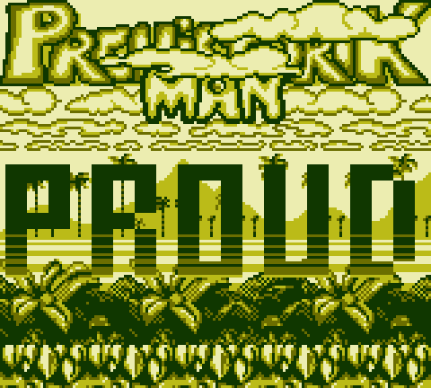

<figcaption>Damn, if you can't be proud of this game...</figcaption>
</figure>

This may be the most puzzling part of the intro.
Those can't be OBJs, since for example the top row in the screenshot would have 13 of them—more than the aforementioned limit of 10.
It's not software rendering, either, as that would be extremely taxing, and the tilemap stays pristine.
Many emulators fail to render this text, too, and only display occasional smears where the text would be.
What's going on?

<figure>

<figcaption>Hel~loo theeere...</figcaption>
</figure>

Yeah.

<figure>

<figcaption>By the way, this is <a href="//github.com/NovaSquirrel/Mesen-SX">Mesen-SX</a>'s Event Viewer. Pretty useful tool!</figcaption>
</figure>

All of this text is achieved through background palette manipulation.

> *"**What!?**"*
>
> —You and I, when hearing about this trick the first time

I know, right?

Here's the thing: the Game Boy <abbr title="Picture Processing Unit">PPU</abbr> seems to go out of its way to never cache values read from rendering parameter registers.
And that includes `BGP`, the background palette register.
So what the game is doing, is simply *spamming* that register to set the palette to fully black when it wants to draw a letter "tile" (thus overriding whatever is below it: no matter the pixel ID, it will map to black), and then back to normal.

This may sound simple in concept (though, again, you have to have the idea first), but poses a few of challenges:

- **How to sync the CPU and PPU?**

  This effect requires the CPU to be synchronized quite tightly with the PPU to write to `BGP` at the right time.
  Fortunately, we can "simply" use interrupts for that.
- **How to go fast enough?**

  The PPU outputs pixels 4× as fast as the CPU executes instructions[^dots], so if we want our line "thickness" to be 8 pixels, we need to be able to write to `BGP` every 2 cycles.
  That's not enough!
  The tightest copy loop ([`ld a, [hli]`](//rgbds.gbdev.io/docs/v0.5.2/gbz80.7/#LD_A,_HLI_) then [`ldh [c], a`](//rgbds.gbdev.io/docs/v0.5.2/gbz80.7/#LDH__C_,A)) takes 4 cycles per iteration.

  What the game does is pretty smart.
  It generates a chain of `ld [hl], d` and `ld [hl], e` instructions in RAM at the beginning of the frame, and executes that.
  Each of those instructions takes 2 cycles, which fits exactly in our allotted budget; the game simply ensures beforehand that `hl` points to `BGP`, and `d` and `e` contain the appropriate palette values.

- **How to "scroll" the letters?**

  The letters are scrolled horizontally by 4 pixels each time, which corresponds to 1 CPU cycle: the game simply delays execution of the "spamming" code by that.
  As for vertical scrolling, it's as simple as changing at which scanline the effect starts being performed.

[^dots]: Kind of. The PPU outputs pixels at 4 MiHz *unless it's being stalled*, and the CPU really executes instructions are 4 MiHz—but all instructions take multiple of 4 such clock cycles, so the simplification is often made that the CPU cycles are at 1 MiHz. Or 2 MiHz in the Color's double-speed mode.

## Credits

This is very similar to the intro text above, but there's also a bit of funny history attached to this.

<lite-youtube videoid="nnkTfiOYEsg" params="start=767" playlabel="Play Prehistorik Man's credits">
  <a href="https://youtube.com/watch?v=nnkTfiOYEsg" class="lty-playbtn" title="Play Video">
    Play a video of <i>Prehistorik Man</i>'s credits
  </a>
</lite-youtube>

(*Please excuse the flicker if watching at 60 fps: the game flickers the background between alternating colors to create more nuances of gray, but emulators have trouble replicating the effect.*)

The way the flipping effect is achieved is that the game spams the vertical scrolling register (`SCY`) mid-scanline, just like it spammed the background palette register for the intro text.
Its timing is slightly off, so you may notice some artifacts on the top-left corner of the textbox, and also two columns of subtly glitched text—this is a console revision-dependent bug, as was figured out recently, and the game triggers it by its timing falling on the wrong one of two cycles.
Gah!

Where history meets irony here has to do with the demo *[Demotronic](//www.pouet.net/prod.php?which=7175)*, which was released in 2002 for the GBC, and claims to be the first ever to perform "vertical raster splits" on Game Boy... which, as we just saw, *Prehistorik Man* did first, and on the B&W console no less!
(Though, *Demotronic* does it better.)

I guess it just goes to show how much this game flew under the radar 😛.

## Music

The music in this game uses what's called *Zombie Mode* to create envelopes in software.
(Sorry, no pictures for this section!)

Usually, instrument envelopes use [ADSR](//en.wikipedia.org/wiki/ADSR_envelope): Attack, Decay, Sustain, Release.
The Game Boy's hardware is not able to do full ADSR envelopes, more like just "DS".
And, perhaps more annoyingly to many, it is not possible to manipulate the amplitude in software to work around this.
(Why that is it still unclear.)

Well, it's not possible by conventional means, anyway.
However, by "tickling" the amplitude register in "just the right way", it's possible to trick the envelope into updating nonetheless.
(The details are unfortunately not documented anywhere I'm aware of, and they are quite complicated. 😢)

Unfortunately, the way *Prehistorik Man* uses Zombie Mode does not work on most Game Boy Colors.
(Yes, there are six different revisions of the GBC, from "CPU CGB" to "CPU CGB E"!)

## Conclusion

Well, I hope this post was interesting!
I think this game shows how much more potential the Game Boy has than most assume it does.
Many of these tricks are actually not hard to perform once you know about them!

Any feedback on this article is welcome, be it [directly on GitHub](//github.com/ISSOtm/issotm.github.io/blob/master/content/blog/2022-05-22-prehistorik/index.md), or [by contacting me](@/about.md#contact).

If this article inspired you to try your hand at making Game Boy games, [please feel free to join our community](//gbdev.io)!
I'm active there, and we'll all be happy to [help you getting started](//gbdev.io/chat).

I also wonder if anyone will disassemble this game... (I'll add a link if one is made.)

## Special thanks

- [Eievui](//evie.gbdev.io) for help with the OBJ overlap visualization
- [SuperDisk](//nickfa.ro) for proofreading
- [beware](//www.bircd.org) for BGB
- [GBDev community](//gbdev.io), especially [avivace](//avivace.com), for support

<link rel="stylesheet" href="/assets/lite-yt/lite-yt-embed.css" />

