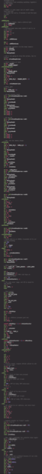

+++
title = "Pseudo-ops Considered Harmful"
authors = [ "stuff@eldred.fr (ISSOtm)" ]

[taxonomies]
tags = [ "gbdev" ]

[extra]
breadcrumb = "Pseudo-ops"
+++

Assembly programmers have been drawn, ever since macros were invented, to macros that encapsulate several instructions.
This essay attempts to capture why, in spite of their attractiveness, I have consistently argued against them.

<!-- more -->

<style>
.float { float: left; clear: left; }
.float > pre { margin: 0 1em 0 0; }
.scrollable { max-height: 20em; overflow: auto; }
</style>



I would like to highlight that my opinion is not an absolute truth; the goal of this article is to pen down several arguments I've seen in debates regarding pseudo-ops.

If the pros resonate with you and the cons don't... then use pseudo-ops!
If they work for you, then more power to you; and you can even feel more confident that you've made an informed decision.

And, if you have any counter-points about anything that's being said here, please feel free to leave a comment at the bottom, and I'll update this post.



First, let's make clear what we _are_ talking about.

## What is a pseudo-op

A “pseudo-op” is a macro that generates one or more assembly instructions.
The name stems from it pretending to be an assembly instruction, or “operation”.

## Why they are attractive

Assembly is as close to the machine as we can get, short of writing raw bytes directly; thus, it has very little structure, and overall very little for humans to latch onto.

In particular, assembly is very stingy with **names**.
In all (sane) programming languages, every manipulation of a variable is done using that variable's name, and thus it helps keep in memory what manipulation is being made:

```rs
input_index += 1;
```

By contrast, assembly forces us to write with non-descript names a _lot_ of the time:

```rgbasm
inc c
```

Pseudo-ops allow giving names to some sequences of instructions.
Here is a real-world example:

```rgbasm
MACRO add_a_to_hl
    add l
    ld l, a
    adc h
    sub l
    ld h, a
ENDM
```

This **grouping** aspect is also important: it helps the eye not get lost in the absolute _stream_ of instructions.

<figure><div class="scrollable">



</div><figcaption>Assembly has a reputation for being a very “vertical” language. (This image is scrollable!)</figcaption></figure>

And, pseudo-ops are also very attractive because they enable reuse of small snippets of code (like [these](https://gbdev.gg8.se/wiki/articles/ASM_Snippets) and [those](https://github.com/pret/pokecrystal/wiki/Optimizing-assembly-code)), without copy-pasting them.

## Pitfalls and footguns

And yet, I'd argue that for all the good they bring, pseudo-ops do overall more harm than good.
We've seen the good, let's explore the bad.

### The pseudo-op side of assembly is a pathway to many behaviours, some consider unnatural[^palpatine_joke]

First, pseudo-ops _don't_ behave in natural ways.
For example:

```rgbasm
add_a_to_hl
jr c, .overflow
```

On it face, this seems logical: we check the carry flag after an instruction.
And, indeed, with the following implementation, it works:

```rgbasm
MACRO add_a_to_hl
    ld c, a
    ld b, 0
    add hl, bc
ENDM
```

But, with the implementation we saw some time earlier (which I've reproduced below), the `jr c, .overflow` is wrong!

```rgbasm
MACRO add_a_to_hl
    add a, l
    ld l, a
    adc a, h
    sub a, l ; The carry flag is last updated by *this* instruction!
    ld h, a
ENDM
```

The first problem of pseudo-ops is that they are **leaky** abstractions.
Depending on how they are implemented, they can or cannot be used in ways that seem to make sense.

Which brings us to...

[^palpatine_joke]: This is a mutation of [a line Palpatine says in _Star Wars Ⅲ_](https://www.youtube.com/watch?v=qwMYuAiKdwI&t=25).

### Write-only programming

Writing code is easy; _reading_ and understanding code, however, is the hard part.
(Debugging involves re-reading code, even if you've previously written it.)

Pseudo-ops need care taken _depending_ on how they are written; this makes code using them require, counter-intuitively, _more_ brainpower; because you need to remember what the side effects of each pseudo-op is.
This is also true of regular instructions, but there is only a single set of them, so it's possible to learn; whereas pseudo-ops are anything but standardised across projects (and sometimes within).

For example, let's take this innocent-looking loop:

```rgbasm
    ld hl, 0
.multiply
    add_a_to_hl
    dec b
    jr nz, .multiply
```

With both of the macros shown above, this breaks:

- <div class=float>
  	
  ```rgbasm
  MACRO add_a_to_hl
      ld c, a
      ld b, 0
      add hl, bc
  ENDM
  ```

  </div>

  With this implementation, the `b` counter gets overwritten by the macro; and thus, the loop is infinite.
  This can be fixed by preserving the register:

  ```rgbasm
      ld hl, 0
  .multiply
      push bc
      add_a_to_hl
      pop bc
      dec b
      jr nz, .multiply
  ```

- <div class=float>
  	
  ```rgbasm
  MACRO add_a_to_hl
      add a, l
      ld l, a
      adc a, h
      sub a, l
      ld h, a
  ENDM
  ```

  </div>

  With this implementation, the `a` register gets destroyed by the macro; and thus, the result is incorrect.
  This can be fixed by preserving the register:

  ```rgbasm
      ld hl, 0
  .multiply
      push af
      add_a_to_hl
      pop af
      dec b
      jr nz, .multiply
  ```

...but note how the correct solution _isn't the same_ depending on how the macro is written!

And, further, adding these `push`es and `pop`s makes the loop roughly _twice_ as slow.
Maybe this isn't much if done once, but pseudo-ops tend to get used pervasively, and thus I fear that performance would die a death by a thousand cuts&mdash;and thus without a clear fix.

Also, pseudo-ops don't show up when debugging; so then, you would be staring at code that's become alien to you (since it doesn't match what your editor is showing), and thus you'd have to think extra hard about what the code _is_ doing.

I would also like to point out that even if the macros make sense to you right now, they wouldn't to anyone else you might ask for help (for wvatever reason), to yourself in a month or two, or to anyone who looks at your code to learn from it.
When I first started doing assembly, this felt easy to brush aside as “well I don't need anyone else to work on this”, but later on I bit my fingers _hard_ because of it.

### Over-engineering

Let's pick back up from a macro we had above:

```rgbasm
MACRO add_a_to_hl
    add a, l
    ld l, a
    adc a, h
    push af
    sub a, l
    ld h, a
    pop af
ENDM
```

a common change is to make the macro accept any 16-bit register as its destination:

```rgbasm
MACRO add_a_to_r16
		add a, LOW(\1)
		ld LOW(\1), a
		adc a, HIGH(\1)
		push af
		sub a, LOW(\1)
		ld HIGH(\1), a
		pop af
ENDM
```

This is well and good, but it's also a slippery slope, the end-game of which is macros like the following:

<figure><div class="scrollable">

```rgbasm
;;;
; Loads byte from anywhere to anywhere else that takes a byte.
;
; ldAny [n16], 0
; Cycles: 5
; Bytes: 4
; Flags: Z=1 N=0 H=0 C=0
;
; ldAny [r16], 0
; Cycles: 3
; Bytes: 2
; Flags: Z=1 N=0 H=0 C=0
;
; ldAny r8, [n16]
; Cycles: 5
; Bytes: 4
; Flags: None
;
; ldAny r8, [r16]
; Cycles: 3
; Bytes: 2
; Flags: None
;
; ldAny [n16], r8
; Cycles: 5
; Bytes: 4
; Flags: None
;
; ldAny [r16], r8
; Cycles: 3
; Bytes: 2
; Flags: None
;
; ldAny [r16], [r16]
; Cycles: 4
; Bytes: 2
; Flags: None
;
; ldAny [r16], [n16]
; Cycles: 6
; Bytes: 4
; Flags: None
;
; ldAny [n16], [r16]
; Cycles: 6
; Bytes: 4
; Flags: None
;
; ldAny [n16], [n16]
; Cycles: 8
; Bytes: 6
; Flags: None
;
; ldAny [n16], n8
; Cycles:
; Bytes:
; Flags: None
;
; ldAny r16, SP
; Cycles:
; Bytes:
; Flags:
; Affects: HL
;
; ldAny SP, r16
; Cycles:
; Bytes:
; Flags:
; Affects: HL
;;;
macro ldAny
    ;FAIL "\1 \2"
    ; Are 16 bits involved?
    IF ((STRIN(STRCAT(R16,"SP"), "\1") != 0) && (STRLEN("\1") == 2)) \
    || ((STRIN(STRCAT(R16,"SP"), "\2") != 0) && (STRLEN("\2") == 2)) \
    || (STRIN("\2", "SP ") == 1) \
    || (STRIN("\2", "SP+") == 1)
        ld16 \1, \2
    ELSE
        ; Force an ldh?
        IF (STRSUB("\1", 1, STRLEN(LDH_TOKEN)) == LDH_TOKEN)
IS_P1_HRAM\@ SET 1
; strip off the #
P1\@ EQUS STRSUB("\1", STRLEN(LDH_TOKEN) + 1, STRLEN("\1") - STRLEN(LDH_TOKEN))
        ELSE
P1\@ EQUS "\1"
IS_P1_HRAM\@ SET 0
        ENDC


        ; Force an ldh?
        IF (STRSUB("\2", 1, STRLEN(LDH_TOKEN)) == LDH_TOKEN)
IS_P2_HRAM\@ SET 1
; strip off the #
P2\@ EQUS STRSUB("\2", 2, STRLEN("\2") - 1)
        ELSE
P2\@ EQUS "\2"
IS_P2_HRAM\@ SET 0
        ENDC


        ; If loading to or from A, we only need a single instruction.
        IF STRUPR("\1") == "A"
            IF IS_P2_HRAM\@ == 1
                ldh A, P2\@
            ELIF "\2" == "0"
                xor A
            ELSE
                ld A, \2
            ENDC
        ELIF STRUPR("\2") == "A"
            IF IS_P1_HRAM\@ == 1
                ldh P1\@, A
            ELSE
                ld \1, A
            ENDC
        ELSE
            ; We only need a single instruction when loading
            ; * r8, r8/n8/[HL]
            ; * [HL], r8/n8
            ; * (so anything without [] unless it's [HL])
            IF ((STRIN("{P1\@}", "[") == 1) && (STRIN("\1", "]") == STRLEN("\1")) &&  ("{P1\@}" != "[HL]"))
IS_P1_DIRECT\@ SET 0
            ELSE
IS_P1_DIRECT\@ SET 1
            ENDC


            IF ((STRIN("{P2\@}", "[") == 1) && (STRIN("\2", "]") == STRLEN("\2")) &&  ("{P2\@}" != "[HL]"))
IS_P2_DIRECT\@ SET 0
            ELSE
IS_P2_DIRECT\@ SET 1
            ENDC


            IF ((IS_P1_DIRECT\@ == 1) && (IS_P2_DIRECT\@ == 1))
                IF ("{P1\@}" == "[HL]") && ("{P2\@}" == "[HL]")
                    ld A, [HL]
                    ld [HL], A
                ELSE
                    ld P1\@, P2\@
                ENDC
            ELSE
                ; otherwise, we need to load into A first.


                IF "\2" == "0"
                    ; xor A is cheaper than a ld A, 0
                    xor A
                ELIF IS_P2_HRAM\@ == 1
                    ldh A, P2\@
                ELSE
                    ld A, \2
                ENDC


                IF IS_P1_HRAM\@ == 1
                    ldh P1\@, A
                ELSE
                    ld \1, A
                ENDC
            ENDC
        ENDC
    ENDC
endm
```

</div><figcaption><a href="https://github.com/joeldipops/gbz80-pseudoOps/blob/abaf2315edd7a9d91daffbdbbe2a8026781614e8/ops.inc#L91-L249">Source</a> on GitHub</figcaption></figure>

...and I don't think this is a good idea.

I think, going back on the topic of pseudo-ops being write-only, that this macro probably made sense while it was being written incrementally.
However, as an outside observer, I cannot grasp how it works, nor grok the various usage kinds and constraints of each.

To me at least, this macro has grown so complex, and with so many “classes” of usage, that it doesn't reduce the cognitive load over just writing the instructions.
It _is_ terser, but at what cost?

## Acceptable pseudo-ops

I don't think _all_ pseudo-ops are bad.
For example, here is one I enjoy using:

```rgbasm
MACRO lb
    assert -128 <= (\2) && (\2) <= 255, "Second argument to `lb` must be 8-bit!"
    assert -128 <= (\3) && (\3) <= 255, "Third argument to `lb` must be 8-bit!"
    ld \1, (LOW(\2) << 8) | LOW(\3)
ENDM
```

This macro is simple and straightforward, while being clearer than the instruction that it's wrapping, so I think it's a good pseudo-op to use.

Based on that, feel free to write other pseudo-ops if you think they are simple yet clearer than what they generate.

## Alternatives

Instead of pseudo-ops, I would suggest using the following to bring the same benefits without their drawbacks:

- Are you yearning for names attached to your operations?
  Comment all the things!

  ```rgbasm
  xor a ; Set a to 0.
  ```

- Are you yearning for operations to be grouped?
  Use RGBASM's new `::` syntax!

  ```rgbasm
  ; Add a to HL.
  add a, l :: ld l, a
  adc a, h :: sub a, l :: ld h, a
  ```

## “Training wheels”

In conclusion, I think pseudo-ops can be thought of like bicycle training wheels.
If you want to learn assembly, then maybe they can help you with some of its aspects while learning other tricky bits; and in that regard, it seems fair to use them.

But I also think that they are something that should be grown past eventually; or, in other words: **don't get used to pseudo-ops**.

And if you're struggling even with them... then maybe assembly isn't made for you, and you can try using a compiled language instead?
I have seen several people trying their hand at assembly, and dropping it; it is, after all, a very different paradigm, so there is nothing wrong with it “not sticking” with you.
