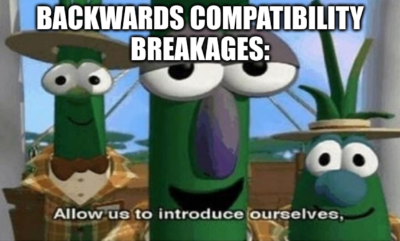

+++
title = "Dealing with mistakes"
authors = [ "stuff@eldred.fr (ISSOtm)" ]

[taxonomies]
tags = [ "gbdev", "back-compat" ]

[extra]
breadcrumb = "Mistakes"
+++

Since there _will_ be mistakes, for one reason or another, let's explore the various ways they can be handled, and each's tradeoffs.

<!-- more -->

## Sticking to the status quo

This is \*the\* strictly backwards-compatible option: keep the mistake, and just... live with it.

At a cursory glance, this is the simplest option, since it requires no effort, beyond maybe documenting the mistake.


If you _do_ choose this option, please please _please_ spare the effort to **document** the bug in a relatively visible way. It is not a great feeling to discover that not only have you "been astonished", but it feels even worse to learn that other people have been through that same "journey" before you.


This option's positive effect is obvious, too: what used to work, keeps working.
That might seem inconsequential, but it has more implications than meets the eye: simply ask the question "why does old stuff matter?"

### Bitrot

[Bitrot][bitrot] is the phenomenon of Things ceasing to Work over time[^rot].
Since adapting code demands effort, bitrot creates churn.
And not just to modify the code itself: those changes need testing, and updating all other related things (documentation, whatever may be depending on or otherwise interacting with what was modified&mdash;yes, bitrot cascades...), _and_ deploying the new modifications.

It thus makes sense that since a backwards-incompatible change creates bitrot, keeping backwards compatibility avoids creating churn for other people.

In addition, the adaptation's changes inherently carry some of the famous "risk" you have probably, if you work in this industry, heard from the mouth of many managers.
But for the sake of clarity, I'll explain what I mean: "risk" is, roughly, "risk that something else will break due to these changes".

Worse still: projects under active development may be able to pay the costs of adapting to the bitrot, but projects that are either abandoned or can't pay those costs... simply won't.
And will thus stick to an old version of RGBDS, despite the disadvantages of _that_.

<figure>

</figure>

### Preservation (of history)

Another aspect worth talking about is preservation.
Arguably, it's only it's a consequence of bitrot, but I feel like it's worth highlighting.

Game Boy development is one of several fields which enjoys not just a flourishing activity today, but also a long and storied past.
This motivates some people to archive said history, document it, and yet more...
But, backwards incompatible changes are a hurdle for those archivists.
Why is that?

Well, let's consider [Pocket Music], which is one of the commercial GB games that was made with RGBDS, and whose source code has recently been published.
The source code is not all that useful on its own: if nothing can be done with it, it's "inert" in a way, and a bit pointless.
So ideally, people would be simply able to get that source code, a copy of RGBDS, and build the code[^tools].

Except... there are a bunch of wrinkles here.

If the version of RGBDS is too old, then it will be missing features and/or bugfixes required to (correctly) build the game.
I think this is fair, because arguing against this implies never adding any features _period_, which I think everyone will agree is unreasonable.

So then, there is a minimum boundary on the version of RGBDS required.
Well, fair enough: any recent version will do, then!

See, if the code relies on any behaviour which was later changed incompatibly, then any version after that breakage is _not_ suitable!
Which means that there now is an _upper_ bound on the required version as well.

This creates logistics problems: if you want to work on more than one single project, you now need more than one version of RGBDS on your machine.
Which now requires you to specify which version of RGBDS, among those on your machine, to use to build this or that project...
And, unless you're fine with having a bunch of identical copies of RGBDS scattered throughout your machine, also means that you need a centralised "RGBDS version manager"[^nvm], since traditional software distribution mechanisms focus on having a single version available globally.

### Knowledge fragmentation

Like preservation, this too is essentially a consequence of bitrot, but with enough weight to merit being discussed separately.

You see, it's not just code that gets affected by bitrot.
"Peripheral" writings, such as documentation, tutorials, and references, are also tightly coupled to the code they relate to.

This means that those writings lose their value with breaking changes; but importantly, _not because of any change to the writing itself_.
This is important, because there is a general assumption that if something doesn't change, then its properties don't either.
For example, reputation, and relatedly, search engine rankings.

The net effect is that prominent knowledge bases become outdated **without any visible signs** of that decay.
This tends to create not only fragmentation of knowledge (again: search results becoming stale without the search engines being aware), but also confusion for people—mostly newbies—who aren't expecting such fragmentation or decay.

[^rot]: The use of the term "rot" can be a little misleading, because code does not intrinsically _rot_; rather, the environment around it changes, eventually rendering it non-functional.

[^tools]: Sure, some extra tools may be necessary, not just RGBDS. But let's focus on just RGBDS for now; the points being brought up also apply to said other tools. (Which also means that the effect compounds, thereby reinforcing the point that back-compat is important!)

[^nvm]: People familiar with the Node ecosystem may have noticed the suspiciously similar naming to [NVM], the Node Version Manager. This may or may not be foreshadowing.

## Fixing the Fuckups

So, those were a lot of good arguments; there is definitely a strong incentive not to break anything... but then, why would we want incur so many negative consequences?
Well, it turns out that inaction itself also has costs.

### Sacrificing the future for the sake of the past

I think this could be described as a sort of "reverse [bitrot]".

As mentioned [in the previous post](@/blog/backcompat/part1.md#the-case-against-back-compat), sometimes backwards-incompatible changes are **necessary** to fix some earlier mistakes.
This means that refusing backwards-incompatible changes also implies _not_ fixing those mistakes.

This decision means that every future project now has to deal with, maybe work around, that mistake.
In a way, the churn that fighting "bitrot" entails, is instead incurred on any _new_ code&mdash;hence my calling this phenomenon "reverse bitrot".

In particular, if people have several options, papercuts will weigh negatively against any option that has them.
Staunchly sticking to inconvenient behaviours means that alternatives will be more compelling to pick than yours.
(And if they don't exist yet, the creation of said alternatives will become more compelling too.)

This, I believe, **dooms the tool to eventual irrelevance**.
...which, when you think about it, sounds awfully similar to the knowledge fragmentation that was touched on earlier.
The difference being that the tool itself becomes obsolete, not just the code using it or the tutorials documenting it.

### You Can't Fight Fate

If the only way to do something is through some undocumented bug or method, people won't stop doing it; they'll just do it the undocumented way.
The corollary is, if your tool can do <var>X</var> and people want to do <var>X</var>, you better give them a way to do <var>X</var>!
Otherwise, they'll find a way to do it anyway, and you'll be stuck supporting that.

The need for change can simply come not from a mistake, so to speak, but from the context around the tool chainging, new use cases arising...
I'd say that users nowadays expect more out of their tools (better UX, more helpful error messages...), and that this need is valid.
Resisting this need is likewise going to doom the tool to irrelevance, being considered as a relic of the past more than something still useful.

Note, however, that this does _not_ mean that tools ought to change regularly!
The old <q>don't fix what ain't broke</q> saying _does_ have value, even though it tends to be abused as an excuse not to fix something that's not _too_ broken yet.

<figure>

<figcaption>This was a lot of words, so here's a picture of my cat Pachatte. Cat nerds can click the kitty to see her full-res :)</figcaption></figure>

## Picking your poison

The takeaway, to me, is that both options—keeping or breaking backwards compat—end up **causing the same problems**, just in different ways!
Put another way: the costs are the same, they're only paid by different people.

There are biases, though!
For example, existing users will be more vocal and know better how to make themselves heard than new users, particularly if the latter are simply driven away before their first interaction.
Also, I believe it's generally easier to under-estimate the impact (dare I say, the ["astonishment"](@/blog/backcompat/part1.md#it-sounded-better-in-my-head)) on future users compared to existing ones.

Finally, there are subjective[^librul] aspects that preclude any universal answer: perhaps you're not expecting to get many new users, maybe the position of your tool within a toolchain makes breakage unacceptably costly...
For RGBDS, specifically, we have decided that new users are more important than existing ones.
This helps ensure that our tool stays relevant, and both new users _and_ some older ones who've kept up with the changes, have expressed a lot of gratitude about it.

That said, there is also nuance in how to break compat; while I think strict immobility is poor, arguably some ways of breaking backwards compatibility are even worse.
Let's tackle that in the next section!

[^librul]: Possibly there is some merit to the "[software liberal versus conservative]" theory, though I find that post overly biased in favour of conservativeness. This series of posts is, partly, also a response.

[bitrot]: http://gwern.net/holy-war#bitrot
[Pocket Music]: https://web.archive.org/web/20220223141052/https://illusion.64history.net/2022/pocket-music-gbc-source
[NVM]: https://nvm.sh
[beware]: http://bircd.org
[software liberal versus conservative]: http://gist.github.com/mrnugget/49ad3ee4043c746e42187e2820ddc2f6
