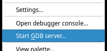
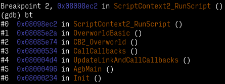
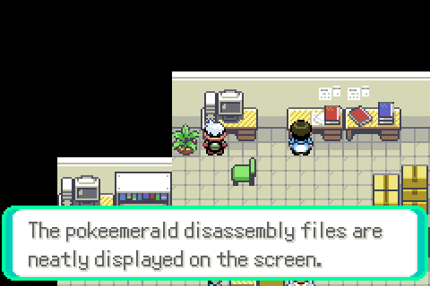
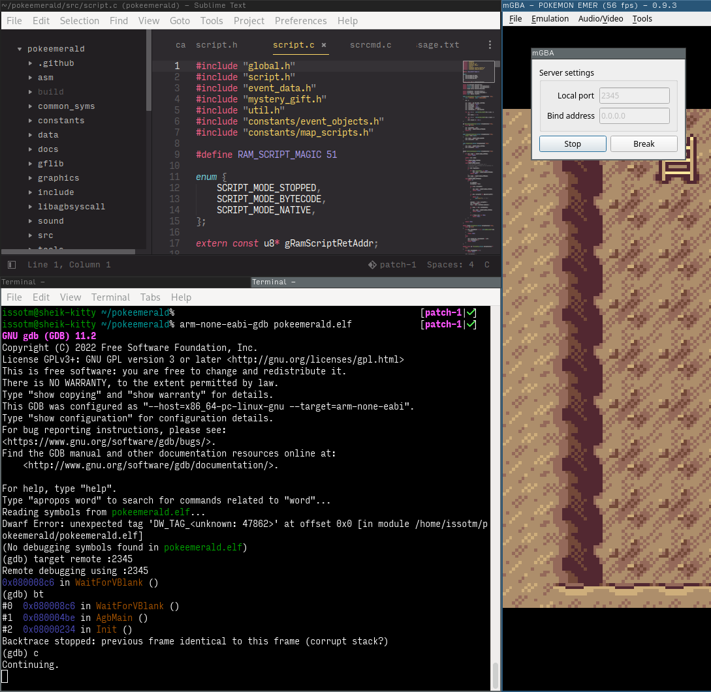

+++
title = "Cracker Cavern Reborn 1"
weight = 1
+++

> *Hacking Ⅰ: Walking through walls*

<!-- more -->

Let's start simple.
This challenge simply involves getting to the following map... the ladder to which is surrounded by solid rocks, oh noes! 😱

There is also an NPC that offers you to open up the path if you can give it a Luxury Ball.
(I think it's there for non-technical users to still be able to complete this challenge. The title you get for completing CCR1 is "Script Kiddie", after all?)
I didn't go with this solution because I wanted to challenge myself a bit.

This should partly explain this post's length; on top of that, I'll also talk about setting up some tools that will stay useful throughout the other articles.

You'd also think a simple walk-through-walls cheat would work—however, ZZAZZ warns about "basic anti-cheat protections" being implemented, so probably not.
I took a hint from the previous editions, where the anti-cheat was simply checking if you were standing on top of collision: if I replace one of the rocks with a non-solid tile, then I'm not cheating, right?[^wtw]

[^wtw]: Something else I thought of was to edit the ROM to stub the "is there collision?" function, but I didn't feel like doing that. Amusingly, we ended up doing exactly that when pfero later [set out to explore unused maps](//cdn.discordapp.com/attachments/959199845191659540/960527009866473562/output.mp4).

## Setting up

Our most important and powerful ally for the last few years has been the sacred **Debugger** 👼&nbsp;\**heavenly choir*\*&nbsp;👼.
So I wanted to get that set up.

Good ol' [BGB](//bgb.bircd.org) had an integrated debugger; [mGBA](//mgba.io) also apparently has one—

<figure>

<figcaption>OwO what's this?</figcaption>
</figure>

So yeah, mGBA supports debugging using [GDB, the GNU debugger](//sourceware.org/gdb).[^gdb_server]

Okay, great—I'm well acquainted with GDB, so more power to me.
However, I'm still lacking symbols!

<figure>

<figcaption>I dunno if you ever tried working with raw addresses only. Imagine the above, but without the names: it's not fun.</figcaption>
</figure>

Thankfully, the good folks at [pret](//github.com/pret) have us covered:

<figure>

<figcaption>Shoutouts to all pokeemerald contributors, btw. Matching decompilation is a monumental b***ch.</figcaption>
</figure>

Since mGBA is an emulator also meant for making your own games (and ROM hacks, I guess), it has conveniences for debugging.
One of those, obviously, is loading symbol information; this is done by loading [ELF files](//en.wikipedia.org/wiki/Executable_and_Linkable_Format) instead of plain GBA ROMs[^elf].

We can build an ELF file with debug info by building [pokeemerald](//github.com/pret/pokeemerald.git) with `make DINFO=1`.
Loading `pokeemerald.elf` in mGBA works just like loading the ROM, except that we have symbol information now! [^relocs]

Next hurdle is that I can't use my system's GDB.
You see, GDB needs to be aware of the target system's CPU architecture (if only to be able to decode instructions to print them!), as well as which OS is running (none), and some more conventions known as [an *ABI*](//en.wikipedia.org/wiki/Application_binary_interface).
This is known as a *target triplet*.

My system's GDB says:
> This GDB was configured as "x86_64-pc-linux-gnu".

...but I want `arm-none-eabi`, not `x86_64-pc-linux-gnu`.[^which_triplet]
Sure. I can just `pacman -S arm-none-eabi-gdb` to install the right flavor of GDB, and be on my merry way.

Then, it's simply a matter of starting mGBA's GDB server, running `arm-none-eabi-gdb pokeemerald.elf`.
I get a "Dwarf error", but that's because (I think) the ARM compiler inserts debug info that my GDB does not understand.
The end result is that I don't have type information or source mappings, but I can manage without, so it's fine.[^arm_gdb]

<figure>

<figcaption>Checkpoint!</figcaption>
</figure>

[^gdb_server]: The way GDB servers work is that the "remote" (here, mGBA) starts up a server, which then your GDB sends commands to to control execution of the process being debugged (here, the emulated game). It's also possible do more, like the memory poking discussed in this article.

[^elf]: ELF files are more typically used on Unix PCs. However, since compilation toolchains used for the GBA are the same as those used for those Unix PCs, they already produce ELF files, and it's simpler for mGBA to support this well-documented format than to come up with its own thing. GDB is also used because it works well together with ELF files.

[^relocs]: Whereas a GBA ROM is simply a plain dump of the cartridge's contents, an ELF file contains "sections" of data and informations on what those sections *are*, and where they go. Thus, mGBA parses that info, and ends up arranging the data in the same way it would have by just loading the ROM. However, some of the *other* sections contain symbol info, which, well... 👀

[^which_triplet]: How do I know which triplet I want? I Know™ that the compiler that was used to compile pokeemerald targets the `arm-none-eabi` triplet, so I need a GDB configured for the same. (You can actually find "`arm-none-eabi`" mentioned in the "modern" build instructions.) You can make any GCC tell you which triplet it's compiling for with `-v` ("verbose"), and looking at the `Target:` line.

[^arm_gdb]: I could've installed [ARM's `gdb`](//developer.arm.com/tools-and-software/open-source-software/developer-tools/gnu-toolchain/gnu-rm/downloads) instead. I tried grabbing the binaries, but they require dependencies older than I have, and compiling from source wouldn't have been worth the effort. So I stared at assembly a whole lot. 🙂

## Gathering intel

Ok, now to figure out how to patch the map.
I opened pokeemerald, and looked for things related to collision.

```bash
$ rg -i collision
...
src/fieldmap.c
59:    block = gMapHeader.mapLayout->border[i] | MAPGRID_COLLISION_MASK;                              \
362:    return (block & MAPGRID_COLLISION_MASK) >> MAPGRID_COLLISION_SHIFT;
820:            gBackupMapLayout.map[x + gBackupMapLayout.width * y] |= MAPGRID_COLLISION_MASK;
822:            gBackupMapLayout.map[x + gBackupMapLayout.width * y] &= ~MAPGRID_COLLISION_MASK;
...
```

Ooh. Interesting.

```c
bool8 MapGridIsImpassableAt(int x, int y)
{
    u16 block = GetMapGridBlockAt(x, y);

    if (block == MAPGRID_UNDEFINED)
        return TRUE;

    return (block & MAPGRID_COLLISION_MASK) >> MAPGRID_COLLISION_SHIFT;
}
```

Following `GetMapGridBlockAt`, I learn that the map is stored in `struct BackupMapLayout gBackupMapLayout`.

```c
struct BackupMapLayout
{
    s32 width;
    s32 height;
    u16 *map;
};
```

## The execution

Since my GDB doesn't have debug info, I have to e**x**amine the **3** 32-bit **w**ords (pointers are 32-bit on the GBA, conveniently):

```bash
(gdb) x/3xw &gBackupMapLayout
0x3005dc0 <gBackupMapLayout>:	0x0000001b	0x0000001a	0x02032318
```

This tells me that the map is 27 tiles wide by 26 tall, and the actual data is stored starting at `0x02032318`.[^gBackupMapData]
After figuring out the coordinates for one of the rock tiles, I simply replace it with a floor tile, and resume the game:

```bash
(gdb) set ({short[702]}0x2032318)[14 + 16 * 0x1b] = 0x3201
(gdb) c
```

Having successfully Thanos-snapped this pesky barrier away, I proceeded to the next challenge...

[^gBackupMapData]: As it turns out, this is the `gBackupMapData` array. Did I mention that I was going into Gen 3 completely blind?
