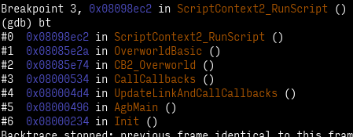
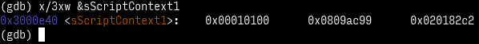
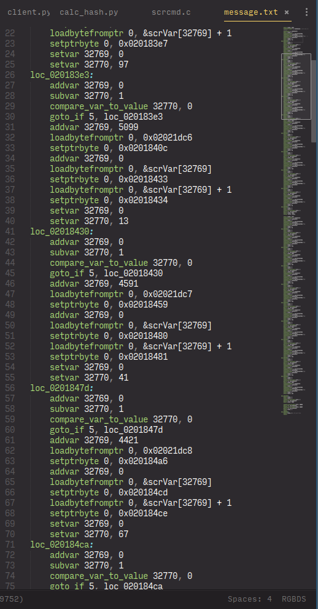

+++
title = "Cracker Cavern Reborn 3"
weight = 3
+++

> *Hacking Ⅲ: Scripting*

<!-- more -->

Oh boy.

In 2018, CC3 was a fairly complex crackme (very few solved it until the answer was leaked).
This year... yeah, basically the same :D

The NPC asks you to enter a password, then validates it *in your game*.
If it's correct, the password gets sent to the server for validation, and that's how you access CCR4!

At this point, I had teamed up with [pfero](//github.com/mid-kid) (whom I've already mentioned a few times already, lol) in a voice chat.
Screen sharing and filming whiteboards were involved! 😎

The first step is getting ahold of the validation logic.
Well, since ZZAZZ appears to be really piggybacking on top of the Gen 3 engine, we can simply look for scripts:

<figure>

<figcaption><code>bt</code> is a shorthand for "backtrace", which analyzes the <em>stack</em> to figure out which functions called the one we currently are in.</figcaption>
</figure>

The next step is to dump the script's contents to analyze them.
For that, we can examine the `struct ScriptContext sScriptContext1`:

<figure>

<figcaption>The first word contains an unused padding byte, then the "comparisonResult" (don't care), then the mode (<code>SCRIPT_MODE_BYTECODE</code>), then the "stack depth". The second word contains the "native pointer" (currently ignored since we are in "bytecode" mode), and the last word contains the "script pointer"—this is where the script currently being executed is.</figcaption>
</figure>

As it turns out, that script simply prints the NPC's text, shows the "naming screen", then calls the *real* checking script.
We dumped that, and pfero wrote a quick program to turn that into text, which we then manually annotated.

<figure>

<figcaption><em>*War flashbacks from the 2019 ROP challenge*</em></figcaption>
</figure>

[I've uploaded the final annotated script](script.txt), if you want to follow at home.
Using assembly syntax highlighting, especially RGBDS, proves surprisingly effective.

Anyway, at first, this seems daunting.
But, it's actually not all that bad!
A more thorough look reveals that the structure is actually quite simple.

The first thing to know is that (as our comment helpfully points out) `0x02021dc4` is where the first character of the input string lies.
[The character encoding is documented](//github.com/pret/pokeemerald/blob/8103caea153f0ab905a00d1f3ee99d088d294659/charmap.txt), so we know those.
Okay.

Similarly, the byte read from the string is written by the `setptrbyte` to the operand of the `addvar` just following it.

The next thing was figuring out that the `loadbytefromptr` commands were actually reading scripting variable 32769 (the same one that's constantly being used everywhere), and the `setptrbyte`s are writing to the first `addvar` in the loop.
This is also pointed out by the ASCII arrows in the comments.

And, best of all, all of these patterns repeat!
These loops are basically a lot of copy-paste—suddenly not as daunting, phew.

Now, when we considered that each of those loops only add N to variable 32769 and decrement variable 32770 on each iteration... we realized that they are just multiplication loops.

So the logic could be simplified to the following C code:
```c
uint16_t value = 6969;
value += str[0];
value *= 73;
value += 6367;
value += str[1];
value *= 97;
value += 5099;
// ...
```

...which is suddenly really simple.
This operation is done a second time with a second set of numbers; and at the end, both computed results must equal certain values for the password to be considered valid.

But, it's not because we had cracked the script that we had cracked the puzzle.
After all, we had yet to generate a valid password from what are basically two fat equations.
Bruteforcing wasn't really an option, as there are 77 valid characters and 10 slots, thus **7,326,680,472,586,200,649** possible passwords.

Yeah.

And so, this is where I bust out—

Maths.

[](//xkcd.com/208/)

The first realization was that we can simplify those equations.
We currently have equations like this:

```c
(((6969 + str[0]) * 73 + 6367 + str[1]) * 97 + 5099 + str[2]) * ... == 45295
```

... but we can use [distributivity](//en.wikipedia.org/wiki/Distributive_property) to simplify this to:

```c
(73 * 97 * ...) * str[0] + (97 * ...) * str[1] + ... + (6969 * 73 * 97 * ...) == 45295
```

and then to the canonical form:

```c
(73 * 97 * ...) * str[0] + (97 * ...) * str[1] + ... == 45295 - (6969 * 73 * 97 * ...)
```

...and everything in the parentheses is a bunch of constants, so we can calculate them once and for all.
This gives us the following two equations to satisfy (I'll start noting `str[n]` as `xn` for simplicity):

```c
39437 * x0 +  5029 * x1 + 27077 * x2 + 27289 * x3 + 42225 * x4 + 31931 * x5 + 26271 * x6 + 32695 * x7 +  5893 * x8 +  83 * x9 == 32062
 4223 * x0 + 53389 * x1 + 28537 * x2 + 37895 * x3 + 16717 * x4 + 20523 * x5 + 33497 * x6 + 54325 * x7 + 31861 * x8 + 151 * x9 == 12232
```

Okay, cool, but we've not really simplified the problem yet.
I guess we reduced the number of operations—that's a start.
[*Others have pointed out that this would have been the right moment to use a solver like [Z3](//github.com/Z3Prover/z3/wiki). Welp, TIL!*]
But the most important thing is that this allows us to reduce the number of variables; let me explain.

When trying to solve linear equations (which, yes, is what this is), roughly speaking, each equation "pins" one variable down.[^linalg]
Since we have 10 variables and 2 equations, that still leaves 8 variables "free"; so the idea is to pin them to arbitrary characters' values, solve the remaining 2×2 equation system, and check if the solution maps to two acceptable characters.

...unfortunately, I couldn't figure out how to implement solving linear equations in Python[^numpy], so I ended up just bruteforcing the last two characters.
It's still a bit faster than "plain" bruteforcing, I think, due to the above reducing the number of operations required.

Honestly, at this point, I'm pretty sure that the problem was "loose" enough that this bruteforcer yielding results in acceptable time is basically luck.
But, I'm not going to complain.

This password was accepted, and it seems that the server liked it enough to let us meet the final ~~boss~~ challenge.
Brace yourselves...

(I've uploaded [the final program](calc_hash.py), if you want to try it out, or judge my code :P)

[^linalg]: Actually, equations may turn out to be redundant, or outright unsatisfiable (imagine `x + y = 1` and `x + y = 2`, no `x` and `y` can satisfy both of those at the same time!). We can ignore those cases here, because we know at least one solution exists—otherwise the challenge would just be unsolvable.

[^numpy]: I tried using [numpy](//numpy.org/doc/stable/reference/generated/numpy.linalg.solve.html), but that doesn't work with *modulo* arithmetic.
