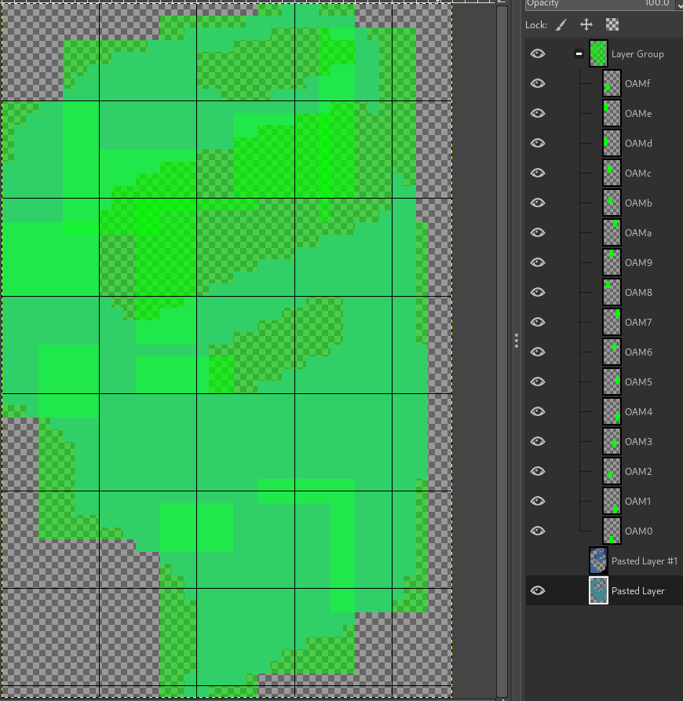

+++
title = "Quartet cracktro"
weight = 1
path = "quartet"

[taxonomies]
tags = [ "gbdev" ]
+++

[*Quartet*](https://makrill.itch.io/quartet) is a great homebrew Game Boy game, published by Mackerel Interactive in early 2021.
So why not do like the good old days and [crack it](https://www.pouet.net/prod.php?which=87951)?

In this post(-mortem?), I'll explain what went into creating this cracktro.
I'll keep the most technical details out of the way until the end of this post, so it should still be a good read, even if you don't have a technical background.

<!-- more -->

## Context

[Dalton](https://github.com/dalton-tulou) released this game on Jan 8th, 2021.
It's honestly a pretty good game in its own right, also well polished for all of DMG, SGB and GBC.

By the way, Dalton [was a demoscener back then](https://www.pouet.net/user.php?who=1289), notably on the Game Boy.
He programmed [a trainer for a previous homebrew release](https://www.pouet.net/prod.php?which=80612), which sparked this idea.

So, we set out to make a cracktro, and it had to be as polished as the base game.

## Decisions

First order of business (actually second, since I started REing the ROM first) was deciding what we wanted the cracktro to be.

The original plan was to have something very parallax-heavy, simulating a bunch of layers; perhaps a landscape?
This eventually led to:

> &lt;ISSOtm&gt; Playing on a Game Boy on the back seat of a car at night..?

The plan stuck.
I drafted something real quick:

<figure>


<figcaption>Made quickly with GIMP, at 160×144 to be sure of proportions.</figcaption>
</figure>

Doc proposed a design fairly quickly:

<figure>


<figcaption>Honestly, this is pretty much the final, lol</figcaption>
</figure>

I send pictures of me holding a GBC for reference, and he reworked the "cube", in his own terms :P

After that, I fired up [Aseprite](https://github.com/aseprite/aseprite) to design the light's animation:

<figure>


<figcaption>You might spot slight differences to the final. We had to make some cuts...</figcaption>
</figure>

## First implementation

I set out to display this on the actual console.
(Well, emulators, since they have debuggers :P)
I started with the monochrome console first, since it would be quicker and easier.
Believe it or not, but we were already hitting a snag.

<figure>


<figcaption>Can you spot the problem?</figcaption>
</figure>

See, the Game Boy only has 4 colors.
Dark for the background, dark gray for the character's body and the window frame, light gray for the character's head and arms, and white for the Game Boy and the light.

Wait, but there's supposed to be light on top of the Game Boy!

### Terrible LCD to the rescue!

[The Game Boy has a fairly cheap LCD](https://gbdev.io/pandocs/#specifications), in accordance with Gunpei Yokoi's philosophy when designing the console.
Notably, it has a *really bad* response time: pixels take some time to change their luminance.
This tends to cause some kind of blur, especially when the whole screen moves at once.
Some games only ran at 30 fps on the Game Boy because it avoided that problem.

We exploit this slow response time by [*blinking* the Game Boy between white and light gray](https://github.com/ISSOtm/quartet-intro/blob/c90fdf9534be5bd1c705db1d06761509ed5b3356/src/patch.asm#L595-L602), effectively creating a 5<sup>th</sup> color!

<figure>
	<video controls width="320px">
		<source src="first_light.webm" type="video/webm">
		<source src="first_light.mp4" type="video/mp4">
		Sorry, your browser doesn't support embedded videos, and GIFs don't play at 60 fps, so this effect doesn't show.
	</video>
</figure>

This isn't *great*, but it's better than nothing; and besides, few are going to check it out on DMG, so it's not that big of a deal.

### "Sprite carpet"

Now, how to do this efficiently? We can't just store two copies of the Game Boy graphic, that'd be woefully inefficient.
No, instead, we'll use color palettes.

See, many retro graphics did not store colors directly, since that would take a lot of memory.
Instead, pixels stored *indices*, which were then used to index *color palettes*.
This sacrificed color diversity for memory, and enabled some effects.

For example, to fade out the entire screen, you wouldn't edit each pixel, you'd simply change the few colors they refer to.
Lightning flashes can also be performed cheaply by temporarily replacing all colors with white.
Etc etc.

In our case, we'll make the Game Boy (the one the character is holding, not the console this is running on :P) use a different color palette, and we'll simply blink one color in the palette.
...that said, the Game Boy only has *one* palette for its background.
Oh no!

(Note: I'll be using the term "sprites" to refer to hardware *objects*, which is technically a misnomer... but I'm too used to it. Sorry!)

Well, it *does* have two separate palettes for sprites... but now the Game Boy graphic must be rendered using sprites.
Ugh.

Game Boy sprites have a fixed size: either 8×8 or 8×16 pixels (toggled by [a global switch](https://gbdev.io/pandocs/#lcdc-2-obj-size)).
The Game Boy graphic is 35×57, so we'll need to use a lot of different sprites to make up the graphic.
Figuring out the optimal arrangement is a process I call "sprite carpeting", and which I do in GIMP using a *lot* of layers.

<figure style="image-rendering: auto;">



<figcaption>Using one layer per sprite, at 50% opacity, lets me see where there's overlap, which can potentially be optimized away.</figcaption>
</figure>

This takes *hours* of painful work.
And then I have to manually encode all the positions in code...
And finally, I have to manually extract the relevant pixel data, and finally fix the couple mistakes I inevitably made.

<figure>


<figcaption>This doesn't exactly match the carpeting above, since it had to change a bit down the line.</figcaption>
</figure>

There are two reasons why the carpeting must be optimal, which pertain to two of the Game Boy's limitations: "**10-per-line**" and "**40 sprites**".
The Game Boy only has room for 40 sprites, though it's possible to cheat a bit (as you'll see later).
The Game Boy's <abbr title="Picture-Processing Unit">PPU</abbr> is only able to display 10 sprites *per scanline* (scanline = row of pixels).
Unlike the "40 sprites" limitation, there is absolutely no way to bypass this one.

Anyway, you saw the GIF, the console displays nicely, and the light animation works.
Since it's quite technical, I won't get into how the light animation is achieved until near the end of this post.

Now that the base is there, let's move on to the next step.

## Text

First off, Doc' came up with a few fonts.

<figure>


<figcaption>We quickly agreed that we'd need bigger characters for them to be easily legible. I still like how this looks.</figcaption>
</figure>

<figure>


<figcaption>Doc started working on 8x16 characters. I'm honestly impressed with how fast and good he is.</figcaption>
</figure>

<figure>


<figcaption>This is essentially the final version. Shame that a lot of characters go unused in the final...</figcaption>
</figure>

And then is a comment that I came to regret later...

> &lt;doc&gt; sry its a mess to work with<br>
> &lt;doc&gt; shouldve been thinkin about tile space<br>
> &lt;ISSOtm&gt; That should be fine<br>
> &lt;ISSOtm&gt;<br>

At this point, I had implemented the Game Boy graphic (green tiles near the top), the character's light animation (dark tiles in the middle) and the background (the rest), and we had plenty of space remaining.
So I thought we'd be fine.
I had forgotten that I had yet to implement the Game Boy's light animation...

## Interlude: ROM update

At this point, DevEd tried to compile the code, which mysteriously failed on some asset conversion on his Mac.
I sent him my build directory, and this worked—somehow.
Comp00terz, I guess?
However, the ROM that he then built misbehaved *a lot*—as in, it crashed.
Why?

Our cracktro does not contain the original game's code—instead, we use [RGBLINK's "overlay" feature](https://rgbds.gbdev.io/docs/v0.4.2/rgblink.1#O) to essentially patch the ROM in-place.
This does require obtaining a legitimate copy of the game (the "base ROM" / "baserom") in the first place, which was fairly easy—just follow the link at the very top of this page to get one for free!

Except, as it turns out, Dalton had released a new version of the ROM!
And it also turned out that applying our patch to this version wasn't viable, ugh.
I guess it also means that our cracktro preserves an earlier version of the game?
Anyway, I sent DevEd my base ROM, and off we went.

## Download more RAM?

At this point, I finished implementing the Game Boy's light animation, and it was time to start working on the text.
First step was adding the font.

```
ERROR: src/patch.asm(384):
    Assertion failed: Too many tiles! ($9950 > $9800)
```

NOOOOOOOOOOOOOOO

We had more tiles than the Game Boy's video RAM could contain at once.
Were we doomed?
*At once*...

It's not necessary to keep the entire animation's tiles loaded at all times, since only the current frame's are displayed.
See where this is going?
We can load new tiles from ROM on each new frame!

### Access granted

The catch is that accessing the Game Boy's video memory has to be the most annoying thing on that platform.
There are two chips that can try to access video RAM: the <abbr title="Central Processing Unit">CPU</abbr>, and the <abbr title="Picture Processing Unit">PPU</abbr>: the former as part of the game program, the latter to push pixels to the LCD.

Thing is, the PPU has priority over the CPU for accessing <abbr title="Video RAM">VRAM</abbr>.
While the PPU is "locking" VRAM, reads from the CPU return `$FF`, and importantly for us, **all writes are silently ignored**.
I won't go into too much detail into this, but this, and the way the light animation is performed, severely restrict how much time can be spent writing to VRAM, and thus, how many tiles we can load per frame.

If you're curious, [this is the tile-streaming code](https://github.com/ISSOtm/quartet-intro/blob/c90fdf9534be5bd1c705db1d06761509ed5b3356/src/patch.asm#L612-L633).

## Music time!

Alright, the looks are good, so let's start to work on the audio side of things.
Since we don't have much free space, we were looking to reuse *Quartet*'s own sound player, if possible.
We knew it uses a modified version of [Carillon](http://gbdev.gg8.se/files/musictools/Aleksi%20Eeben/Carillon%20Editor.zip), we just had to figure out if it was possible to integrate with it, and how.

As it turned out, *Quartet* stores its music data compressed, and so fetches it all from RAM!
This was a blessing for us, since we just needed to do the same.
There was one catch, though: the pattern data format had been changed.

Music data, on many chiptune systems, has two parts: instrument data, which mostly defines their [*timbre*](https://en.wikipedia.org/wiki/Timbre); and "pattern" data, which is essentially a score, telling when to play a note with which instrument.

Instrument data was 1:1 with how vanilla Carillon generated it, but the pattern data went through some hoops I couldn't wrap my head around.
In the end, we decided to [reuse most of *Quartet*'s code](https://github.com/ISSOtm/quartet-intro/blob/c90fdf9534be5bd1c705db1d06761509ed5b3356/src/patch.asm#L970-L974), but [embark the vanilla player's version of the pattern-reading code](https://github.com/ISSOtm/quartet-intro/blob/c90fdf9534be5bd1c705db1d06761509ed5b3356/src/patch.asm#L975-L1196).
Figuring out how to reuse *Quartet*'s pattern-reading code could have spared us some ROM space, but definitely not headaches.
Oh well, the project is open-source, you're welcome to try your hand at this if you're interested :^)

You may be wondering about the SGB-specific music, but I'll come to that later.

## Hello World?

Time to get back to the text.
Due to its size, the window's light animation is rendered using the background, so the text has to be displayed using sprites.
This subjects it to both of the limitations stated earlier:

- No more than 40 sprites total
- No more than 10 sprites per horizontal line

Well, the character's and the Game Boy's light animations both use sprites, as well as the Game Boy, as we've seen earlier.
This only leaves 14 sprites for text, which is... not a lot.
Additionally, on the scanlines where the text may be displayed, there are up to 2 sprites already, due to the character's light animation, limiting us to up to 8 characters per line of text.

Considering that we can avoid using sprites for spaces, 8 characters per line is workable, but 14 characters total is *really* limiting.
Fortunately, as I mentioned earlier, it *is* possible to work around the "40 sprites total" limitation!

Since <abbr title="Object Attribute Memory">OAM</abbr>—the region of memory where sprite data lives—has to be updated really often while being subjected to access restrictions similar to but worse than VRAM's, Nintendo was kind enough to provide us with *OAM [<abbr title="Direct Memory Access">DMA</abbr>](https://en.wikipedia.org/wiki/Direct_memory_access)*.

OAM DMA copies data *really fast* from roughly anywhere in RAM, directly to OAM.
Again, sprites typically get updated every game frame, so being able to copy them quickly is quite the blessing.
(Though, OAM DMA has a few caveats because there *had* to be a catch, but overall everybody likes it.)

However, we're interested in another property of OAM DMA.
I mentioned earlier that the PPU always has priority over the CPU when accessing VRAM, and OAM is no different.
However, OAM DMA surprisingly has priority *over the PPU* when it comes to accessing OAM!
This allows "refreshing" OAM quickly in the middle of a frame, effectively doubling (or more) its capacity, at the cost of some processing time.

But hey, of course there's a catch.
Just like the CPU reads `$FF` from VRAM when it doesn't have access, *the PPU reads `$FF` from OAM while OAM DMA is running*!!
Aside for a few edge cases, this essentially means that sprites are invisible for the transfer's duration.

How long does it last? Around two scanlines, though the effect can persist for a little longer dpending on timing.
Again, not going into details here.

Since the light animations do not have any gaps, we can't use this trick while they're being displayed.
However, we *can* use it just above them!
This would allow the bottom two rows of text to be 8-per-line and 14-total-max, while the upper row is 10-per-line and 40-total-max (effectively 10-total-max, since it's a single row).
This is much more workable.

With that said, I set out to work on the text effect.
The idea is that the window's light briefly covers the entire window area, and the text could be swapped during that time.

<figure>


<figcaption>Well, not exactly, but you see what I mean: it's possible to swap the text when going between these two frames.</figcaption>
</figure>

And thus:

<figure>
	<video controls width="320px">
		<source src="scroller.webm" type="video/webm">
		<source src="scroller.mp4" type="video/mp4">
		Sorry, your browser doesn't support embedded videos.
	</video>
	<figcaption>This is actually the second version of the scroller; the first one only rendered the first line. Also, the light animation is slightly glitched out, due to some unfinished code.</figcaption>
</figure>

## GBC! Power up!

After that came the CGB colorization, but there's nothing interesting to talk about there.
The most I can say is that, due to [attribute clash](https://en.wikipedia.org/wiki/Attribute_clash), two pixels at the top-right of the cartridge are gray when they shouldn't.
I don't know whether nobody noticed, or they just shrugged them off.
They still bother me. >:(

Instead, let's delve into the nightmares that the SGB gave me...

## SGB primer

The [Super Game Boy](https://en.wikipedia.org/wiki/Super_Game_Boy) is an interesting piece of tech.
Conceptually, it's a SNES cartridge with a GB cartridge port; plug in a GB cartridge, turn the SNES and your TV on, and you can play GB games on a big screen!
Some games even support enhancements, typically changing the border ([example](https://youtu.be/HjstlNrwmdg)), and [sometimes more](https://youtu.be/G4uYc3q3SLY?t=152).

How does it actually work, though?
The SNES cartridge actually more or less contains a Game Boy Pocket (notice the chip labeled `SGB CPU 01` [on the circuit board](https://gbhwdb.gekkio.fi/consoles/sgb/gekkio-2.html))!
The `ICD2` chip is responsible for forwarding the SNES' inputs to the Game Boy, and also capturing its LCD output.
A program, the "SGB BIOS", runs on the SNES and copies the ICD2-supplied graphics to the SNES console.

In effect, the Game Boy screen is captured into a framebuffer, and displayed normally by the SNES.
Pretty cool, huh?

Okay, this is where the annoyances begin.
Since the colorization is performed by the SNES, it's essentially a *post-processing* effect—on the GBC, for example, sprites can use different colors; the SGB is not aware of that(!)

<figure style="image-rendering: auto;">


<figcaption>This should help you visualize how the SGB colors an image. Since this scene scrolls horizontally only and the sky is static, I could be a little creative.</figcaption>
</figure>

We can get away with it for the most part, since our scene is mostly static.
Though, I had in mind a small "shake" every so often, like a car hitting a bump in the road.
Due to the SGB's coloring limitations, this had to be scrapped.
Oh well.

## Now you're playing SUPER power!

One of the SGB features used the least is that the Game Boy game can actually send sound data to the **SNES**'s <abbr title="Audio Processing Unit">APU</abbr>, and play tunes using its full 16-bit power!
(See what I did there with the title?)

For no particular reason, we decided to make a SNES cover of the music.

<figure>
	<audio controls>
		<source src="quartroRC1.mp3" type="audio/mpeg">
		Sorry, your browser doesn't support embedded audio.
	</audio>
	<figcaption>
		Original, 8-bit Game Boy version
	</figcaption>
</figure>

<figure>
	<audio controls>
		<source src="quartet_spc.ogg" type="audio/ogg">
		<source src="quartet_spc.mp3" type="audio/mpeg">
		Sorry, your browser doesn't support embedded audio.
	</audio>
	<figcaption>
		SNES version, recorded from real hardware
	</figcaption>
</figure>

[Here is a SPC, if you want one.](quartet.spc)

I personally find the SNES cover a bit more relaxing and to the tone I was going for, but honestly, given Carillon's limitations, DevEd did a really good job, and I like both.

## Borderline crazy

As I said above, many games use a border, and ours was not gonna be an exception... for an entirely different reason, actually.
Attribute clash was going to be much more prevalent on SGB due to way less flexibility in color placement.

<figure>


<figcaption>This is what the SGB version looked like right before I started using the border to cover these attribute clashes.</figcaption>
</figure>

However, the border can actually "intrude" over the GB screen area; we could use this to "patch up" some holes!

I obviously, as you saw above, started with the border itself.
Doc came up with a pretty neat-looking design:

<figure>


<figcaption>This absolutely wrecked our free space, though, I tell ya! Also, did you spot the 'AYCE' there?" width="512px</figcaption>
</figure>

Plus, the border has a bunch of symmetry, which helps a lot with making it fit.
Though, we had to employ some more trickery to actually make the border fit in our space budget, but I'll touch up on that in the technical section further below.

Problem was, this was the very last thing I had to do before the ROM could be called complete... and we were almost out of space.

Believe me, I spent *days* squeezing out enough bytes to patch up as much as possible, but there are still some inconsistencies.
Oh well, seems nobody has noticed.

**Thanks for reading!** If you enjoy this content, or are interested in GB dev, [boy howdy do we have a community for you!](https://gbdev.io/)

## Technical tidbits

Alright, this is where the content stops being noob-friendly, and I dive into some nitty-gritty.
So far, the post has mostly followed chronological order, but order doesn't really matter from now on.
Enjoy!

### Entry point

I touch on this because I think this was an especially clever idea.

All Game Boy ROMs have a jump instruction at $0100 or $0101, since that's where they first gain control.
Cracktros typically patch this jump instruction, but we are *different*...

<figure>


<figcaption>This is unchanged from the original!</figcaption>
</figure>

I figured we'd be really tight on memory, so I wanted to re-use the original game's init code as much as possible.

<figure>

```rgbasm
EntryPoint: ; Only jump here during actual boot-up!!
	; `jp Q_Memcpy` will `ret`, reading the word at `Retpoline`
	; This will abort the init process, jumping into our patch
	ld sp, Retpoline

	cp BOOTUP_A_CGB
	ld a, 0
	jr nz, .notColor
	rr b
	adc a, 2
.notColor
	ldh [Q_hConsoleType], a

	ld hl, Q_OAMDMA
	ld de, Q_hOAMDMA
	ld bc, 8
	jp Q_Memcpy
Init: ; Jump here to re-perform initialization
	sub a
	ld bc, $1FFE
	ld hl, $C000
	call Q_Memset
	sub a
	ld bc, $3E
	ld hl, $FFC0
	call Q_Memset
	ld a, $C0
	call Q_hOAMDMA
	jp Q_Init
```

<figcaption><a href="https://github.com/ISSOtm/quartet-intro/blob/c90fdf9534be5bd1c705db1d06761509ed5b3356/src/patch.asm#L70-L98">Straight from the source!</a> Note that all symbols RE'd from the base game have <code>Q_</code> prefixed, to avoid name clashes.</figcaption>
</figure>

This is mostly identical to the original init code, except that the OAM DMA copy has been moved up, is not `call`ed but *jumped* to, and `ld sp, $E000` became `ld sp, Retpoline`...
What's going on here?

The trick is `Retpoline` itself:
```rgbasm
Retpoline:
	dw Intro
```

When `Q_Memset` returns, `ret` will load `Intro` into `pc`, so this is where execution will continue.
The benefit is that we reach the intro code, having already copied the OAM DMA handler into HRAM.
We don't care about clearing RAM, whereas the game does, so we'll leave that for its own init.
(I personally think doing that is a terrible thing, due to squashing all uninitialized RAM reads, but not everyone agrees.)

Oh, and the console type has been detected for us, saving a *lot* of headaches; we'll just make sure not to modify it, so *Quartet* can init and run smoothly.

As the comment says, once the intro is done, it can just jump to `Init`; since the OAM DMA handler has been copied already, the rest will just work... or will it?
The original game actually zeroed the entirety of HRAM, which would've nuked the OAM DMA handler copy... fortunately, I found out that all variables *before* the handler didn't need to be zeroed, so I truncated the relevant `Q_Memset` call.

### Light animation

So, let's talk about the main course: the light animation.
How does it work?
Well, for one thing, looking at BGB's VRAM viewer may yield some hints.

<figure>


<figcaption>This is the $9800 tilemap...</figcaption>
</figure>

<figure>


<figcaption>...and this is the $9C00 one. Both screenshots are in CGB mode; SGB would look somewhat different. The wrong Game Boy color (pun not intended) is due to it being rendered with sprites.</figcaption>
</figure>

So, what's going on?
Well, the character's and the Game Boy's parts of the animation are done with sprites, nothing ground-breaking there.
The thing that might be the closest to original is that the Game Boy's sprites use streamed tiles; I had to copy them with a [partially-unrolled popslide loop](https://github.com/ISSOtm/quartet-intro/blob/c90fdf9534be5bd1c705db1d06761509ed5b3356/src/patch.asm#L612-L633) to barely manage copying them in a single VBlank.

What about the large animation on the window?
On DMG and SGB, one could suspect well-timed mid-scanline `BGP` writes, but with CGB in the picture, that's ruled out.
Also it'd be pretty difficult to take the sprites into account.

No, what's happening is much simpler.
We're (ab)using the window!
Specifically, [we're overwriting `WX` every (few) scanlines](https://github.com/ISSOtm/quartet-intro/blob/c90fdf9534be5bd1c705db1d06761509ed5b3356/src/patch.asm#L668-L676), a trick I dubbed "WXzardry".
Since the top of the $9800 tilemap is all white, this allows drawing arbitrarily long white lines up to the right side of the screen.

Okay, that works well for half of the animation, but what about the other half, where the white lines are from the left side of the window frame?
Well, then it's sufficient to simply take the problem *backwards*!
We make the background fully white, and draw black stripes from the right side of the screen..!

Palette manipulation to achieve this is out of the question, since both black and white are being used elsewhere on the same scanlines, and mid-scanline color changes are impossible on CGB.
Plus it'd take a lot of code, which is a no-no for us.

Much more simply, we copy the $9800 tilemap to the $9C00 one, applying changes to make the background white.
(We copy the tilemap to only store one instance + [some "specs"](https://github.com/ISSOtm/quartet-intro/blob/c90fdf9534be5bd1c705db1d06761509ed5b3356/src/patch.asm#L942-L962), which is overall much smaller.)

So, at two points of the animation, we swap which tilemap the BG and window are referencing, and we keep hammering away at `WX` :D

Side notes:

- A value of $A6 is invalid for `WX`, causing the window to kind of "overflow" into the following scanlines.
  This value would be what you'd write to get only 1 pixel of the window on-screen.
  Somewhat by design, somewhat by luck, we never need that, so we don't have this problem!
- Given that we have some vertical "runs" of the same `WX` value, the data lends itself quite well to RLE compression.
  Decoding the RLE within the core loop would significantly complexify it, so the RLE data is decoded at startup, and written to a separate buffer.
  The RLE'd data is also RNC-compressed, though I don't know if that actually improves the compression ratio.
  (There's some repetitions even in the RLE'd data, so I'd wager that yet, though I'm not entirely sure.)
- OAM DMA actually screws with the effect slightly.
  As explained earlier, we perform a mid-frame OAM DMA to increase the total sprite capacity.
  However, during the entirety of the OAM DMA, we're running a tight loop in HRAM, so we can't just update `WX` anymore.
  (Maybe a custom wait loop could've updated `WX`, but I'm unsure about accessing I/O regs in the middle of OAM DMA, and I kept it simple for ROM size's sake.)
  This causes the window to extend slightly for a couple of scanlines; I had to tweak a couple of `WX` values for it to look good in my opinion, but it still differs slightly from the original concept.<br>
  Oh, also, the code could've misbehaved from being stalled and thus desyncing with `LY`, but all that it took was [making this jump on `c` instead of `nz`](https://github.com/ISSOtm/quartet-intro/blob/c90fdf9534be5bd1c705db1d06761509ed5b3356/src/patch.asm#L671), which I had already done out of caution.
  The code just performs several quick writes to `WX`, too fast for them to be processed, and then re-syncs normally.
  I guess it paid off!
- I don't think we're the first to do this.
  I remember an effect in [Mental Respirator](http://www.pouet.net/prod.php?which=16402) by [Phantasy](http://www.pouet.net/groups.php?which=754), where a fairly large picture slides from the right side of the screen, over a moving pattern.
  I never looked into how it's actually done, but I think it uses a couple of sprites + WXzardry.
  Hey, Dalton was one of that demo's two programmers.
  What a small world!

### Border bitplane packing

Let's talk about the border again.
The border is neat, but it doesn't look all that impressive: it has some intricate patterns, but is not a color explosion.
In fact, I realized pretty quickly that it was essentially 1bpp (= 2 different colors), whereas SGB border tiles are 4bpp.

(If you're wondering, the SNES operates in [Mode 1](http://problemkaputt.de/fullsnes.htm#snespictureprocessingunitppu), and the border is on BG2. The UI is on the 4bpp BG1 + a few sprites, and the GB framebuffer is on the 2bpp BG3.)

Again, credits to Doc' for making quite good art with little resources!

Anyway, I converted the border quickly, hoping it'd be under 128 tiles so I could perform only 1 `CHR_TRN` transfer...

<figure>


<figcaption>... instead, I got 252.</figcaption>
</figure>

I wouldn't be able to apply the cover-ups with only 4 tiles, uh oh...
Fortunately, as I said, the tiles are essentially 1bpp, and we luckily had 3 palettes available, so we could fit 3 of those 1bpp tiles in bitplanes of the 4bpp tiles, and use specially-designed palettes to "pick" one of these 3 tiles.

<figure>


<figcaption>This is what the packed tiles look like, with a bunch of colors..." width="256px</figcaption>
</figure>

<figure>


<figcaption>... now in grayscale (top-right)...</figcaption>
</figure>

<figure>


<figcaption>... with palette #4 applied...</figcaption>
</figure>

<figure>


<figcaption>... with palette #5 applied...</figcaption>
</figure>

<figure>


<figcaption>... and with palette #6 applied.</figcaption>
</figure>

This crushed the border down to 83 tiles, leaving plenty of room for the cover-ups!

### Heavy data compression

Okay, this isn't really a technique, I'm just making a note of how I organized some data so that it could be compressed.
I think this might be useful to others wishing to achieve similar effects.

The problem is that we needed to compress a *lot* of data, sometimes arranged in complex ways.
I could have used e.g. Python scripts to output the data in question, but I figured I'd try something different.
I tried `rgblink -x`.

[RGBLINK's `-x` option](https://rgbds.gbdev.io/docs/v0.4.2/rgblink.1#x) is actually pretty useful for generating binary blobs, [which I took advantage of](https://github.com/ISSOtm/quartet-intro/blob/c90fdf9534be5bd1c705db1d06761509ed5b3356/Makefile#L76-L78)... well, [actually pretty liberally](https://github.com/ISSOtm/quartet-intro/search?q=.bin.rnc).
The major upside of using this is that you can still use the same tools (macros, definitions, etc.), that RGBASM is, I think, reasonably fast, and it doesn't pull any additional dependencies (e.g. Python, or a C compiler).

The downside is that while RGBASM is almost Turing-complete, it's not always the most convenient.
For example, it's pretty much incapable of reading files; you need to [pass a hex dump via the CLI invocation](https://github.com/ISSOtm/quartet-intro/blob/c90fdf9534be5bd1c705db1d06761509ed5b3356/Makefile#L82-L88), and RGBASM currently has limitations on string length 😓

But hey, that's one more tool available in our toolboxes!
